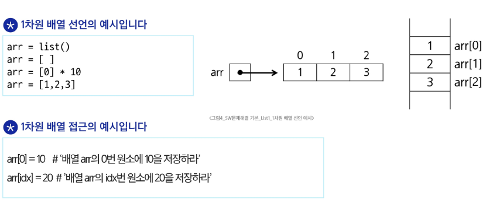
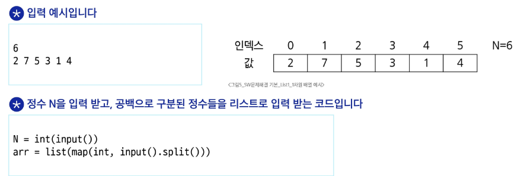
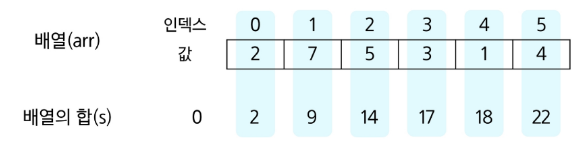
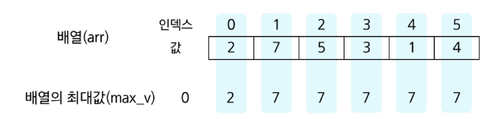
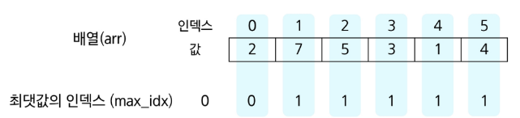
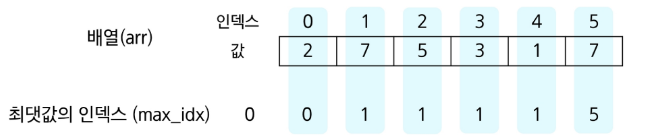
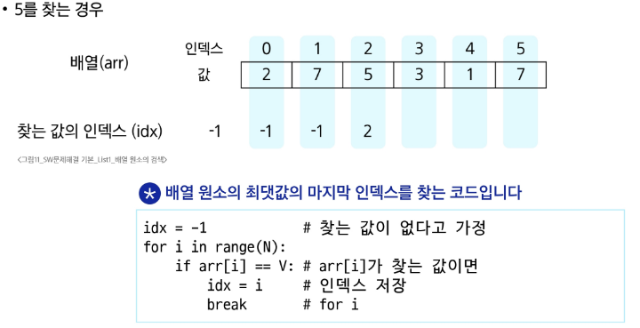

# 배열

- 일정한 자료형의 변수들을 하나의 이름으로 열거하여 사용하는 자료구조

### 예시
- 6개의 변수 사용할때

```python
# Before
n1 = 1
n2 = 2
.
.
.

#After
num = [1,2,3...]
```

### 필요성

1. 여러개 변수 사용시
2. 배열 사용시 하나의 선언을 통해서 둘 이상의 변수를 선언
3. 단순히 다수의 변수 선언을 의미하는 것이 아님

### 1차원 배열
- 배열을 선언할 떈 프로그램에서 사용할 배열 이름 필요



### 입력 받은 정수를 1차원 배열에 저장 방법
- 첫 줄에 앵수의 개수 N이 주어짐(5 <= N <= 1000)
- 다음 줄에 빈칸으로 구분된 N개의 양수 Ai가 주어짐(1<= N <= 1000000)

  
> [!IMPORTANT]
> `arr = list(map(int,input.split))` 이 로직은 정수형 배열 저장형으로 map형식으로 int로 선언을 안하면 문자열로 인식됨 
> 그리고 split() 함수 사용하여 공백 기준 구분함


### 배열 원소의 합 s 계산하기


- 배열 원소의 합을 계산하는 로직

```python
N = 6
arr = [2,7,5,3,1,4]
s = 0
for i in range(N):
    s+= arr[i]
```

### 배열 원소 중 최댓값 max_v 찾기



- 배열 원소의 최대값을 계산하는 로직

```python
N = 6
arr = [2,7,5,3,1,4]

max_v = arr[0]
for i in range(1,N):
    if max_v < arr[i]:
        max_v = arr[i] # arr[i]가 더 크면 max_v 갱신
```

### 배열 원소 중 최댓값의 인덱스 max_idx 찾기


```python
N = 6
arr = [2,7,5,3,1,4]

max_idx = 0
for i in range(1,N):
    if arr[max_idx] < arr[i]: # 더 큰값을 만나면
        max_idx = i # max_idx 갱신
```

### 최댓값이 여러 개인 경우 마지막 인덱스 max_idx 찾기


```python
N = 6
arr = [2,7,5,3,1,4]

max_idx = 0
for i in range(1,N):
    if arr[max_idx] <= arr[i]: # 더 큰값 또는 같은값을 만나면
        max_idx = i # max_idx 갱신
```

### 찾는 값이 배열에 있으면 해당 원소의 인덱스 없으면 -1을 idx에 넣기
- 5를 찾는 경우

