# 카운팅 정렬

- 항목들의 순서를 결정하기 위해 집합에 각 항목이 몇 개씩 있는지 세는 작업을 하여 선형 시간에 정렬하는 효율적인 방식

### 제한 사항
1. 정수나 정수로 표현할 수 있는 자료에 대해서만 적용 가능
2. 카운트들을 위한 충분한 공간을 할당하려면 집합 내의 가장 큰 정수를 알아야 함

> [!NOTE]
> 시간 복잡도는 O(n+k) => n은 리스트 길이 k는 정수의 최대값

### 예시

- `data = [0,4,1,3,1,2,4,1]` 을 카운팅 정렬하는 과정

- 1단계 : data에서 각 항목들의 발생 횟수를 세고 정수 항목들로 직접 인덱스 되는 카운트 배열 counts에 저장한다.

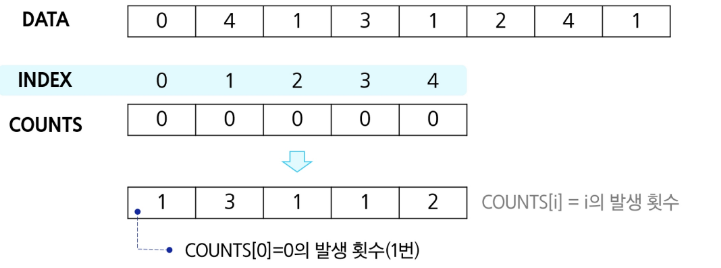

- 2단계 : 정렬된 집합에서 각 항목의 앞에 위치할 항목의 개수를 반영하기 위해 counts의 원소를 조정한다.
  
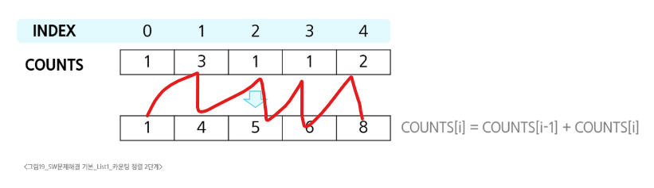

- 3단계 : data의마지막 원소 1의 발생 횟수 counts[1]을 감소시키고 temp에 1을 삽입한다.
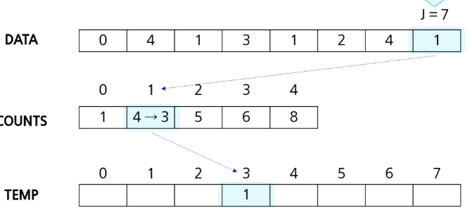
  
- counts[4]를 감소시키고 temp에 4를 삽입

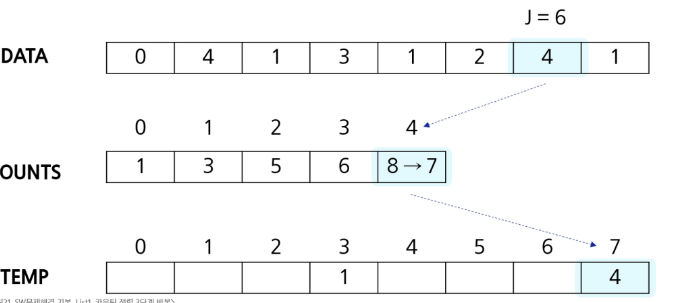

- counts[2]를 감소시키고 temp에 2를 삽입한다.

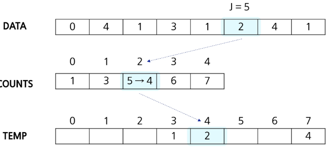

- counts[1]을 감소시키고 temp에 1을 삽입한다.
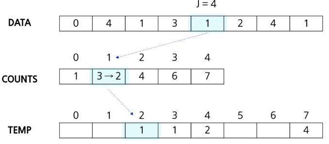
  
- counts[3]을 감소시키고 temp에 3을 삽입한다.
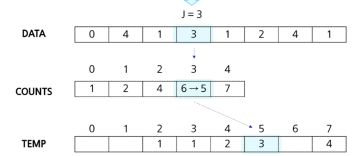
  
- counts[1]을 감소시키고 temp에 1을 삽입한다.
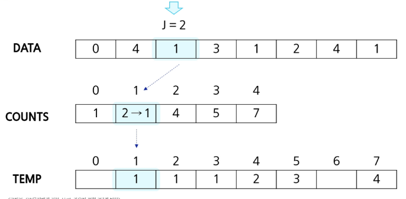
  
- counts[4]을 감소시키고 temp에 4을 삽입한다.
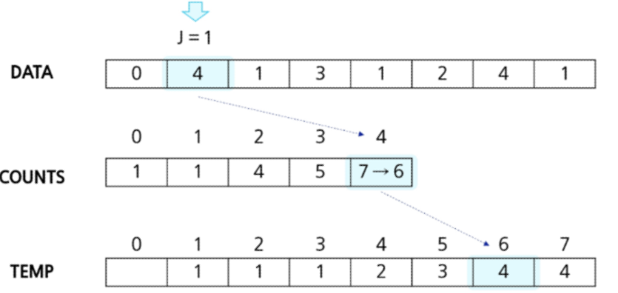
  
- counts[0]을 감소시키고 temp에 0을 삽입한다.
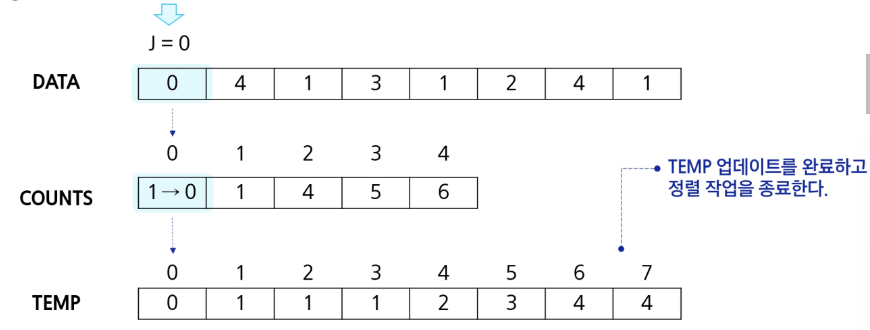
  
## 카운트 정렬 알고리즘

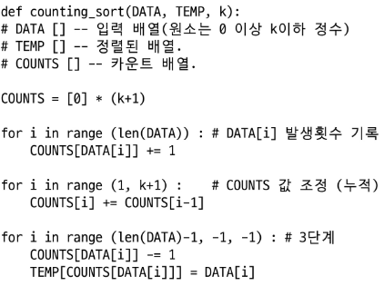

### 정렬 알고리즘 비교

| **알고리즘**       | **평균 수행시간** | **최악 수행시간** | **알고리즘 기법** | **비고** |
|--------------------|------------------|-------------------|------------------|--------|
| **버블 정렬**       | **O(n²)**         | **O(n²)**           | **비교와 교환**       | **코딩이 가장 손쉽다.** |
| **카운팅 정렬**     | **O(n+k)**       | **O(n+k)**         | **비교한 방식**       | **n이 비교적 작을 때만 가능하다.** |
| 선택 정렬           | O(n²)            | O(n²)              | 비교와 교환         | 교환의 회수가 버블, 삽입 정렬보다 작다. |
| 퀵 정렬             | O(n log n)       | O(n²)              | 분할 정복           | 최악의 경우 O(n²)이지만, 평균적으로는 가장 빠르다. |
| 삽입 정렬           | O(n²)            | O(n²)              | 비교와 교환         | n의 개수가 작을 때 효과적이다. |
| 병합 정렬           | O(n log n)       | O(n log n)         | 분할 정복           | 연결리스트의 경우 가장 효율적인 방식 |

