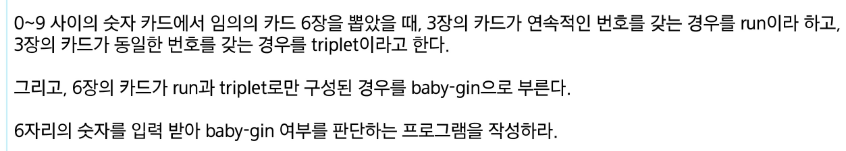
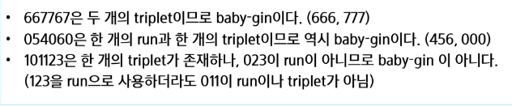
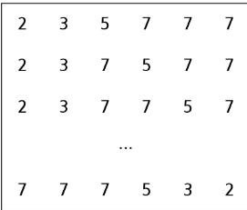
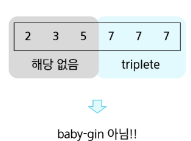
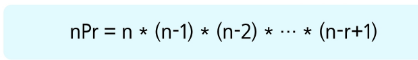
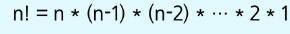

# 완전 검색

### Baby-gin Game





## 완전검색 이란?

- 문제의 해법으로 생각할 수 있는 모든 경우의 수를 나열해보고 확인하는 기법
> [!TIP]
> 모든 경우의 수를 테스트한 후 최종 해법을 도출하는 방법으로 일반적으로 경우의 수가 상대적으로 작을 때 유용

### 필요성
- 완전 검색으로 시작
    - 모든 경우의 수를 생성하고 테스트하기 때문에 수행 속도는 느리지만 해답을 찾아내지 못할 확률이 작다
    - 자격검정평가 등에서 주어진 문제를 풀 때 우선 완전 검색으로 접근하여 해답을 도출한 후 성능 개선을 위해 다른 알고리즘을 사용하고 해답을 확인하는것이 바람직
    
### 완전 검색을 활용한 Baby-gin 접근

- 고려할 수 있는 모든 경우의 수 생성
    - 6개의 숫자로 만들수 있는 모든 숫자 나열(중복 포함)
    - 예) 입력으로 [2,3,5,7,7,7]을 받았을 경우 아래와 같이 순열 생성 가능
    
      
- 해답 테스트 하기 
    - 앞의 3자리의 뒤의 3자리를 잘라 run과 triple 여부를 테스트하고 최종적으로 baby-gin을 판단
    
      
## 순열
- 서로 다른 것들 중 몇 개를 뽑아서 한 줄로 나열하는 것
- 서로 다른 n개 중 r개를 택하는 순열은 아래와 같음
```txt
nPr
```
- 그리고 `nPr`은 다음과 같은 식이 성립

  
- `nPn`은 `n!`이라고 표기하며 팩토리얼 이라 부름

  
### 단순하게 순열을 생성하는 방법

- [1,2,3]을 포함하는 모든 순열을 생성하는 함수
    - 동일한 숫자가 포함되지 않았을 때 각 자리 수별로 루프를 이용해 아래와 같이 구현 가능
    
```python
for i1 in range(1,4):
    for i2 in range(1,4):
        if i2 != i1:
            for i3 in range(1,4):
                if i3 != i1 and i3 != i2:
                    print(i1,i2,i3)
```
