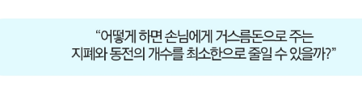
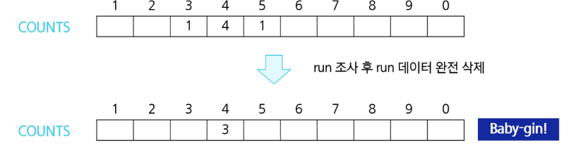
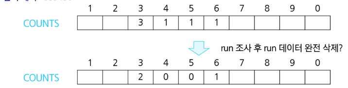
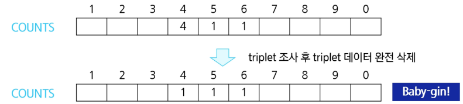

# 탐욕 알고리즘

- 여러 경우 중 하나를 결정해야 할 때마다 그 순간에 최적이라고 생각되는 것을 선택해 나가는 방식으로 진행하여 최종적인 해답에 도달하는 방식

### 특징

- 최적해를 구하는 데 사용되는 근시안적인 방법
- 각 선택의 시점에서 이루어지는 결정은 지역적으로는 최적이지만 그 선택들을 계속 수집하여 최종적인 해답을 만들었다고 하여 그것이 최적이라는 보장은 없음
- 일반적으로 머릿소겡 떠오르는 생각을 검증 없이 바로 구현하면 greedy 접근임

### 과정

1. 해 선택 : 현재 상태에서 부분 문제의 최적 해를 구한 뒤 이를 부분 해 집합에 추가한다.
2. 실행 간으성 검사 : 새로운 부분 해 집합이 실행 가능한지를 확인한다. 곧 문제의 제약 조건을 위반하지 않는지를 검사한다.
3. 해 검사 : 새로운 부분 해 집합이 문제의 해가 되는지를 확인 아직 전체 문제의 해가 완성되지 않았다면 1)의 해 선택부터 다시 시작한다.

### 예시

- 거스름돈 줄이기
  

- 1단계 : 해 선택
    - 여기에선 멀리 내다볼 것 없이 가장 좋은 해를 선택
    - 단위기 큰 동전으로만 거스름돈을 만들면 동전의 개수가 줄어드므로 현재 고를 수 있는 가장 단위가 큰 동전을 하나 골라 거스름돈에 추가

- 2단계 : 실행 가능성 검사
    - 거스름돈이 손님에게 내드려야 할 액수를 초과하는지 확인
    - 초과한다면 마지막에 추가한 동전을 거스름돈 뺴고 1)로 돌아가서 현재보다 한 단계 작은 단위의 동전을 추가

- 3단계 : 해 선택
    - 거스름돈 문제의 해는 당연히 거스름돈이 손님에게 내드려야 하는 액수와 일치. 더 드려도, 덜 드려도 안되기때문에 거스름돈을 확인해서 액수에 모자라면 다시 1)로 돌아가서 거스름돈에 추가할 동전을 고름

### 탐욕 알고리즘을 활용한 Baby-gin 접근

- 6개의 숫자는 6자리의 정수 값으로 입력
- counts 배열의 각 원소를 체크하여 run 과 triplet 및 baby-gin 여부 판단

- [입력] : 444345
  

- [입력] : 333456
  

- [입력] : 444456
  

```python
num = 456789  # baby-gin 확인할 6자리 수
c = [0] * 12

for i in range(6):
    c[num % 10] += 1
    num //= 10

i = 0
tri = run = 0
while i < 10:
    if c[i] >= 3:  # tripelete 조사 후 데이터 삭제
        c[i] -= 3
        tri += 1
        continue
    if c[i] >= 1 and c[i + 1] >= 1 and c[i + 2] >= 1:
        c[i] -= 1
        c[i + 1] -= 1
        c[i + 2] -= 1
        run += 1
        continue
    i += 1
if run + tri == 2 : print("Baby Gin")
else : print('Lose')
```
