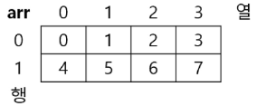
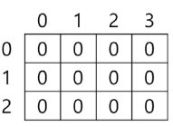
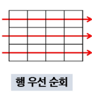
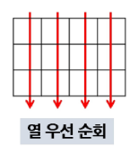

# 2차원 배열

- 1차원 리스트를 묶어놓은 리스트
- 2차원 이상의 다차원 리스트는 차원에 따라 인덱스를 선언
- 2차원 리스트의 선언 : 세로길이(행의 개수), 가로길이(열의 개수)를 필요로 함
- 파이썬 에선 데이터 초기화를 통해 변수선언과 초기화 가능

- arr = [[0,1,2,3],[4,5,6,7]] (2행 4열의 2차원 리스트)
  




> [!IMPORTANT]
> arr = [0][2] 를 출력하면 2가 나온다 즉 앞에 인덱스가 행 뒤가 열을 나타낸다.

### 입력된 수를 2차원 배열에 저장

```python
"""
[입력]
3
1 2 3
4 5 6 
7 8 9
"""

N = int(input())  # 3
arr = [list(map(int, input().split())) for _ in range(N)]  # 3 * 3
```

> [!IMPORTANT]
> 공백이 있을경우 기존이랑 동일하게 하되 N값까지 순회하도록 즉 N * N 의 2차원 배열 형태로 입력받게 만듬

##### 공백이 없을 경우 `split()` 메서드 뺴고 동일하게 선언

### 0으로 채워진 3*4 배열 만들기



```python
arr = [[0] * 4 for _ in range(3)]  # 3 * 4
```

- 기존 0으로 채워진 4열의 인덱스에서 for 문으로 열을 range 파라미터 값만큼 추가함

## 배열 순회

- n X m 배열의 n * m 개의 모든 원소를 빠짐없이 조사하는 방법

### 행 우선 순회

```python
# i행의 좌표 세로
# j열의 좌표 가로
n = 2
m = 5

for i in range(n):
    for j in range(m):  # 2열 5행 2차원 배열 순회
        pass  # 필요한 연산 수행


```



### N * M 배열의 크기와저장된 값이 주어질 떄 합을 구하는 방법

```python
"""
[입력]
3 4 // 3 * 4 배열 생성
1 7 2 8 
6 2 9 3 
5 7 4 2 // arr 입력 값
"""
N, M = map(int, input().split())
arr = [list(map(int, input().split())) for _ in range(N)]  # 3 * 3

s = 0
for i in range(N):
    for j in range(M):  # 2열 5행 2차원 배열 순회
        s += arr[i][j]  # 행열의 모든 순회값을 인덱스에 담아서 더해주기
```

### 열 우선 순회

```python
# i행의 좌표 세로
# j열의 좌표 가로
n = 2
m = 5

for j in range(m):
    for i in range(n):  # 2열 5행 2차원 배열 순회
        pass  # 필요한 연산 수행
```



> [!NOTE]
> 행 우선과는 달리 열 우선으로 m값이 상위 for문에 있음을 알 수 있음
 
### 지그재그 순회

```python
# i행의 좌표 세로
# j열의 좌표 가로
n = 2
m = 5

for i in range(n):
    for j in range(m):  # 2열 5행 2차원 배열 순회
        pass  # array[i][j + (m - 1 - 2 * j) * (i % 2)]
```

