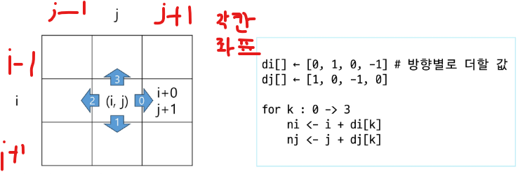
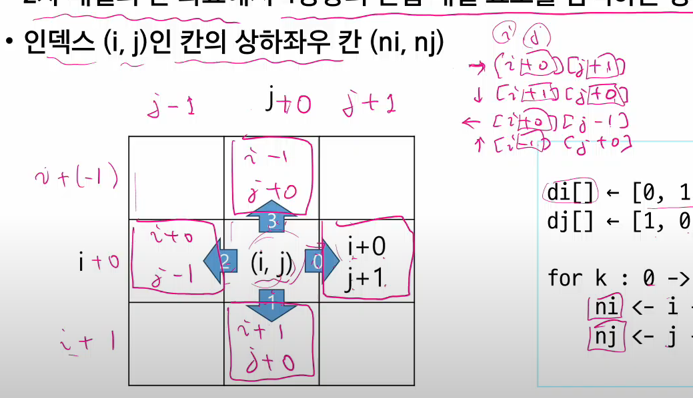
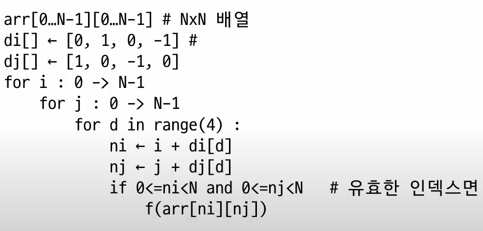
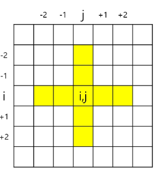
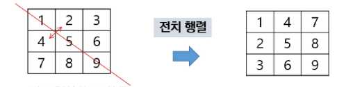
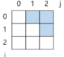
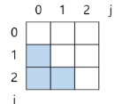
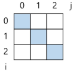
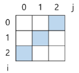

# 델타

### 델타를 활용한 2차원 배열 탐색

- 2차 배열의 한 죄표에서 4방향의 인접 배열 요소를 탐색하는 방법
- 인덱스 i,j인 칸의 상하좌우 칸 ni,nj



- 각 행과 열의 기준칸에서 - 또는 + 가되어 인덱스 값이 부여가 된다.



- 이동이되면서 연산 시 위 사진 속 필기내용과 같음

### 델타를 활용한 2차원 배열 탐색 - 1

- 2차 배열의 한 좌표에서 4방향의 인접 배열 요소를 탐색하는 방법



### 델타를 활용한 2차원 배열 탐색 - 1

```python
for i in range(N):
    for j in range(N):
        for di, dj in [[0, 1], [1, 0], [0, -1], [-1, 0]]:
            ni, nj = i + di, j + di
```

### 델타 응용

- N X N 배열에서 각 원소를 중심으로 상하좌우 합계 중 최대값 단 k=2



```python
max_v = 0  # 최댓값을 저장할 변수

for i in range(N):  # 배열의 모든 행에 대해
    for j in range(N):  # 배열의 모든 열에 대해
        s = arr[i][j]  # (i, j)를 중심으로 시작값 설정

        # 상하좌우 네 방향 설정 (di: 행 변화, dj: 열 변화)
        for di, dj in [[0, 1], [1, 0], [0, -1], [-1, 0]]:
            for c in range(1, K + 1):  # 거리 1부터 K까지
                ni, nj = i + di * c, j + dj * c  # 거리만큼 떨어진 위치 계산

                # 배열의 범위를 벗어나지 않는 경우에만 합산
                if 0 <= ni < N and 0 <= nj < N:
                    s += arr[ni][nj]

        # 지금까지 구한 합 s가 max_v보다 크면 갱신
        if max_v < s:
            max_v = s

```

#### 전체 흐름도

1. 최댓값 저장 변수 초기화 → max_v = 0

2. 2중 반복으로 배열의 모든 원소를 중심점으로 설정 → for i in range(N): for j in range(N):

3. 중심값을 s에 저장 → s = arr[i][j]

4. 상하좌우 델타 방향 반복 → for di, dj in [[0,1],[1,0],[0,-1],[-1,0]]:

5. 거리 1부터 K까지 각각의 방향으로 이동 → for c in range(1, K+1):

6. 다음 위치 계산 → ni = i + di * c, nj = j + dj * c

7. 경계 체크: 배열 안에 있으면 합산 → if 0 <= ni < N and 0 <= nj < N:

8. 현재 방향의 값 누적 → s += arr[ni][nj]

9. max_v 업데이트 → if max_v < s: max_v = s

### 전치 행렬

```python
# i : 행의 좌표 len(arr) - 세로
# j : 열의 좌표 arr[0]

arr = [[1, 2, 3], [4, 5, 6], [7, 8, 9]]  # 3*3 행렬
"""
1 2 3
4 5 6
7 8 9
"""

for i in range(3):
    for j in range(3):
        if i < j:
            arr[i][j], arr[j][i] = arr[j][i], arr[i][j] 
```



> [!WARNING]
> 3*3 배열에서 if 문을 사용한 경우 i<j 일경우 2 3 6 즉 상삼각만 4 7 8 하삼각이랑 바꾸는 즉 열이 더클때 하는거임
> 만일 부등호 방향이 반대이면 하삼각으로 반대 케이스지만 if문이 없을경우 하위 for문 안에는 행의 좌표값을 range의 파라미터로 받아야함

### i(행의 좌표), j(열의 좌표) 의 크기에 따라 접근하는 원소 비교 (N X N)

```python
for i in range(N):
    for j in range(N):
        if None:  # None에 들어가는 값에 따른 결과
            pass
```

- i < j (상삼각)



- i > j (하삼각)



```python
for _ in range(N):
    f(arr[i][i])
```

- i == j(우하향)



```python
for i in range(N):
    f(arr[i][N - 1 - i])
```

- N-1-i == j (우상향)


