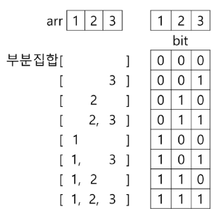

# 부분집합

### 부분 집합 합 문제

- 유한 개의 정수로 이루어진 집합이 있을 때 이 집합의 부분집합 중에서 조건에 맞는 경우를 찾는 문제
- 예) 그 집합의 원소를 모두 더한 값이 0이 되는 경우가 있는지를 알아내는 문제

### 예시

[-7.-3.-2,5,8]라는 집합이 있을 때 [-3,-2,5]는 이 집합의 부분집합이면서 (-3)+(-2)+5 = 0 이므로 이경우의 답은 참이 된다.

### 부분집합 생성하기

- 완전검색 기법으로 부분집합 합 문제 풀기
    - 우선 집합의 모든 부분집합을 생성한 후에 각 부분집합의 합을 계산

- 주어진 집합의 부분집합을 생성하는 방법 생각

### 부분집합의 수

- 집합의 원소가 n개일때 공집합을 포함한 부분집합 수는 2^n개
- 이는 각 원소를 부분집합에 포함시키거나 포함시키지 않는 2가지 경우를 모든 원소에 적용한경우의 수와 같음

> 예 : [1,2,3,4] => 2^4 = 16가지



- arr[i]원소가 부분집합에 포함되지 않으면 bit[i] == 0
- arr[i]원소가 부분집합에 포함되면 bit[i] == 1

### 각 원소 부분집합 포함여부 루프를 이용하여 확인 후 부분집합 생성방법

```python
bit = [0, 0, 0, 0]

for i in range(2):
    bit[0] = i  # 0번 원소
    for j in range(2):
        bit[1] = j  # 1번 원소
        for k in range(2):
            bit[2] = k  # 2번 원소
            for l in range(2):
                bit[3] = l  # 3번 원소
                print(bit)  # 0 또는 1의 모든 경우의수가 출력된다. 즉 [0,0,0,0] ... [1,1,1,1]
"""
[출력]
[0, 0, 0, 0]  # 아무것도 선택되지 않은 부분집합
[0, 0, 0, 1]  # 4번째 원소만 선택된 부분집합을 의미
[0, 0, 1, 0]  # 3번째 원소만 선택
[0, 0, 1, 1]  # 3,4번째 원소 선택
[0, 1, 0, 0]  # 2번째 원소만 선택
[0, 1, 0, 1]  # 2,4번째 원소 선택
[0, 1, 1, 0]  # 2,3번째 원소 선택
[0, 1, 1, 1]
[1, 0, 0, 0]
[1, 0, 0, 1]
[1, 0, 1, 0]
[1, 0, 1, 1]
[1, 1, 0, 0]
[1, 1, 0, 1]
[1, 1, 1, 0]
[1, 1, 1, 1]  # 전체 집합 선택

"""
```

- print_subset 이라는 함수 생성 후 차이

```python
def print_subset(bit):
    for i in range(4):
        if bit[i]:  # bit[i]가 0이아니면
            print(arr[i], end='')
        print(bit)  # 0 또는 1의 모든 경우의수가 출력된다. 즉 [0,0,0,0] ... [1,1,1,1]


bit = [0, 0, 0, 0]
arr = [7, 5, 8, 1]
for i in range(2):
    bit[0] = i  # 0번 원소
    for j in range(2):
        bit[1] = j  # 1번 원소
        for k in range(2):
            bit[2] = k  # 2번 원소
            for l in range(2):
                bit[3] = l  # 3번 원소
                print_subset(bit)
"""
[출력]
[0, 0, 0, 0]      -> 아무 원소도 출력 안 됨
1[0, 0, 0, 1]     -> arr[3]만 출력 → 1
8[0, 0, 1, 0]     -> arr[2]만 출력 → 8
81[0, 0, 1, 1]    -> arr[2], arr[3] 출력 → 8 1
5[0, 1, 0, 0]
51[0, 1, 0, 1]
58[0, 1, 1, 0]
581[0, 1, 1, 1]
7[1, 0, 0, 0]
71[1, 0, 0, 1]
78[1, 0, 1, 0]
781[1, 0, 1, 1]
75[1, 1, 0, 0]
751[1, 1, 0, 1]
758[1, 1, 1, 0]
7581[1, 1, 1, 1]

"""
```

## 비트 연산자

- `&`: 비트 단위로 AND 연산
- `|` : 비트 단위로 OR 연산
- `<<` : 피연산자의 비트 열을 왼쪽으로 이동
- `>>` : 피연산자의 비트 열을 오른쪽으로 이동

### `<<`연산자 활용

- 1<<n : 2^n 즉 원소가 n개일 경우의 모든 부분집합의 수를 의미

### `&`연산자 활용

- i & (1<<j) : i의j번쨰 비트가 1인지 아닌지를 검사

### 비트 연산으로 부분집합을 생성하는 방법

```python
arr = [1, 2, 3]

n = len(arr)  # 원소의 개수

for i in range(1 << n):  # 1<<n: 부분 집합의 개수
    for j in range(n):  # 원소의 수만큼 비트를 교환함
        if i & (1 << j):  # i의j번쨰 비트가 1인경우
            print(arr[j], end=',')  # j번 원소 출력
    """
    [출력]
    1,2,1,2,3,1,3,2,3,1,2,3,
    """
```

---

## 🔍 동작 과정 상세 설명

### 예: `arr = [1, 2, 3]`

부분집합의 개수 = `2^3 = 8`
`i`는 `0`부터 `7`까지 반복합니다.

---

### i = 0 (000)

* `i & (1 << 0)` → 0 & 1 → False
* `i & (1 << 1)` → 0 & 2 → False
* `i & (1 << 2)` → 0 & 4 → False
  → 아무것도 출력 안 됨 → 부분집합: `{} (공집합)`

---

### i = 1 (001)

* `i & (1 << 0)` → 1 & 1 → True → 출력: 1
* `i & (1 << 1)` → 1 & 2 → False
* `i & (1 << 2)` → 1 & 4 → False
  → 부분집합: `{1}`

---

### i = 2 (010)

* `i & (1 << 0)` → 2 & 1 → False
* `i & (1 << 1)` → 2 & 2 → True → 출력: 2
* `i & (1 << 2)` → 2 & 4 → False
  → 부분집합: `{2}`

---

### i = 3 (011)

* `i & (1 << 0)` → 3 & 1 → True → 출력: 1
* `i & (1 << 1)` → 3 & 2 → True → 출력: 2
* `i & (1 << 2)` → 3 & 4 → False
  → 부분집합: `{1, 2}`

---

### i = 4 (100)

* `i & (1 << 0)` → 4 & 1 → False
* `i & (1 << 1)` → 4 & 2 → False
* `i & (1 << 2)` → 4 & 4 → True → 출력: 3
  → 부분집합: `{3}`

---

### i = 5 (101)

* `i & (1 << 0)` → 5 & 1 → True → 출력: 1
* `i & (1 << 1)` → 5 & 2 → False
* `i & (1 << 2)` → 5 & 4 → True → 출력: 3
  → 부분집합: `{1, 3}`

---

### i = 6 (110)

* `i & (1 << 0)` → 6 & 1 → False
* `i & (1 << 1)` → 6 & 2 → True → 출력: 2
* `i & (1 << 2)` → 6 & 4 → True → 출력: 3
  → 부분집합: `{2, 3}`

---

### i = 7 (111)

* `i & (1 << 0)` → 7 & 1 → True → 출력: 1
* `i & (1 << 1)` → 7 & 2 → True → 출력: 2
* `i & (1 << 2)` → 7 & 4 → True → 출력: 3
  → 부분집합: `{1, 2, 3}`

---

## ✅ 정리

| i (이진)  | 포함된 원소 (부분집합) |
| ------- | ------------- |
| 000 (0) | {} (공집합)      |
| 001 (1) | {1}           |
| 010 (2) | {2}           |
| 011 (3) | {1, 2}        |
| 100 (4) | {3}           |
| 101 (5) | {1, 3}        |
| 110 (6) | {2, 3}        |
| 111 (7) | {1, 2, 3}     |
