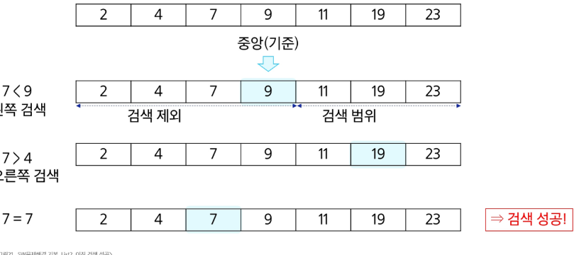
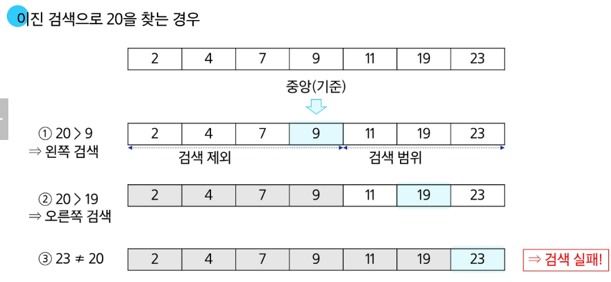
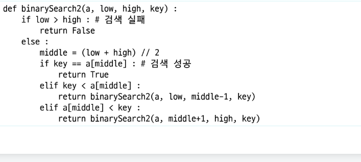

# 이진 검색

- 자료의 가운데에 있는 항목의 키 값과 비교하여 다음 검색의 위치를 결정하고 검색을 계속 진행하는 방법
    - 목적 키를 찾을 때까지 이진 검색을 순환적으로 반복 수행함으로써 검색 범위를 반으로 줄여가면서 보다 빠르게 검색 수행

- 이진 검색 조건은 자료가 정렬된 상태여야만 함

### 검색 과정

1. 자료의 중앙에 있는 원소를 고른다
2. 중앙 원소의 값과 찾고자 하는 목표값 비교
3. 목표 값이 중앙 원소의 값보다 작으면 자료의 왼쪽 반에 대해서 새로 검색을 수행하고 크다면 자료의 오른쪽 반에 대해서 새로검색을 수행 4, 찾고자 하는 값을 찾을때까지 위에 과정 반복

### 7을 찾는경우



### 20을 찾는경우



### 이진 검색 알고리즘

- 검색 범위의 시작점과 종료점을 이용하여 검색을 반복 수행
- 이진 검색의 경우 자료에 삽입이나 삭제가 발생하였을 때 배열의 상태를 항상 정렬 상태로 유지하는 추가 작업 필요

## 구현

```python
def binary_search(a, N, key):
    start = 0
    end = N - 1
    while start <= end:
        middle = (start + end) // 2
        if a[middle] == key: # 검색성공
            return middle
        elif a[middle] > key: # 찾는 값보다 크면
            end = middle - 1 # 왼쪽 구간 선택
        else: # 찾는 값보다 작으면
            start = middle + 1 # 오른쪽 구간 선택 
    return -1 # 검색 실패
```

- 재귀함수도 사용가능



