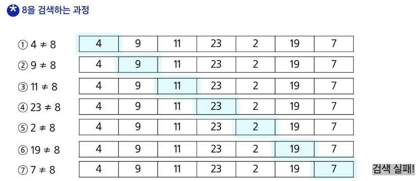
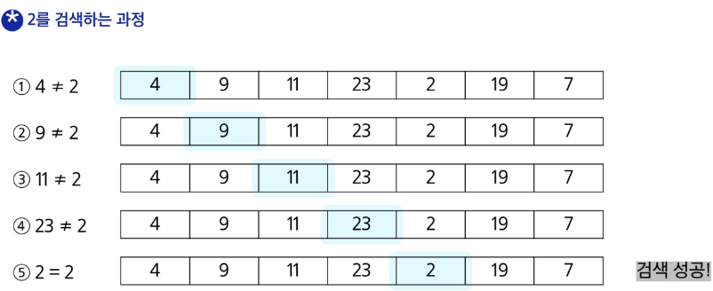
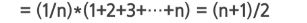
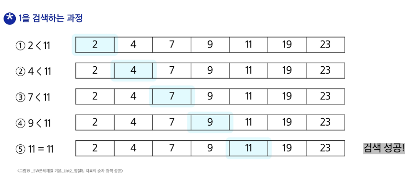
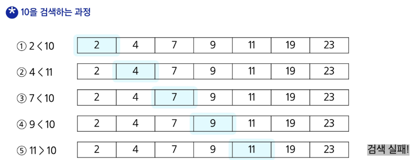
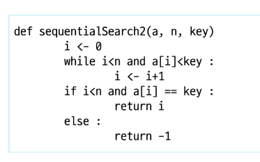
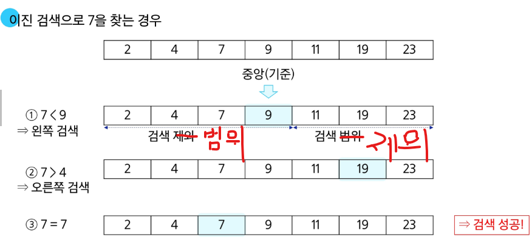

# 순차검색

## 검색이란
- 저장되어 있는 자료 중에서 원하는 항목을 찾는 작업
- 목적으로 탐색 키를 가진 항목을 찾는 것

> [!TIP]
> 검색의 종류 : 순차검색 이진검색 해쉬

## 순차검색
- 일렬로 되어 있는 자료를 순서대로 검색하는 방법
    - 가장 간단하고 직관적인 검색 방법
    - 배열이나 연결 리스트 등 순차구조로 구현된 자료구조에서 원하는 항목을 찾을 때 유용
    - 알고리즘이 단순하여 구현이 쉽지만 검색 대상의 수가 많은 경우에는 수행시간이 급격히 증가하여 비효율적
    
- 정렬 여부에 따라
    - 순차검색 대상이 정렬되어있지 않은 경우 / 정렬되어 있는 경우
    
### 정렬되어 있지 않은 경우 순차 검색
1. 첫 번째 원소부터 순서대로 검색 대상과 키 값이 같은 원소가 있는지 비교하며 찾는다
2. 키 값이 동일한 원소를 찾으면 그원소의 인덱스를 반환
3. 자료 구조의 마지막에 이를때까지 검색 대상을 찾지 못하면 검색 실패

   
### 정렬되어 있는 경우



### 순치 검색 대상이 정렬되어 있지 않은 경우
- 찾고자 하는 원소의 순소애 따라 비교횟수가 결정됨
    - 첫번째 원소를 찾을 때는 1번 비교, 두 번째 원소를 찾을 떄는 2번 비교..
    - 정렬되지 않은 자료에서의 순차검색 성공시 평균 바교 횟수
    

    
- 검색 실패시 마지막 원소까지 비교하믈 평균 비교 횟수 n
- 시간복잡도 : O(n)

### 구현 예시


### 순차 검색 대상이 정렬되어 있는 경우
1. 자료가 오름차순으로 정렬된 상태에서 검색을 실시
2. 자료를 순차적으로 검색하면서 키 값을 비교하여 원소의 키 값이 검색 대상의 키 값보다 크면 찾는 원소가 없다는것이므로 더 이상 검색하지 않고 검색을 종료한다

### 정렬되어 있는 경우에서 검색 성공



### 정렬되어 있는 경우에서 검색 실패


### 정렬되어 있는 경우
- 찾고자 하는 원소의 순서에 따라 비교횟수가 결정
    - 정렬이 되어있으므로 검색 실패를 반호나하는 경우에도 평규 ㄴ비교 횟수가 반으로 줄어든다
    
```
(n+1)/2
```
- 시간 복잡도 O(n)






