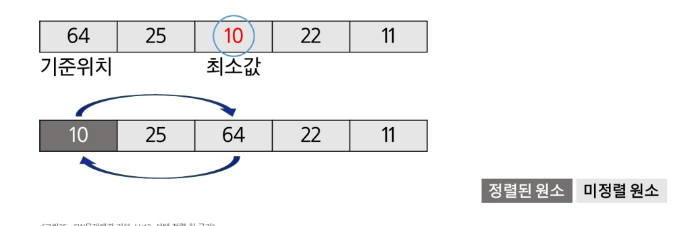
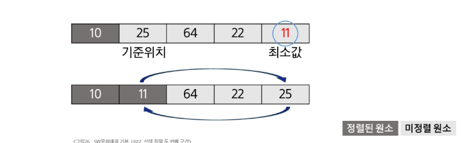
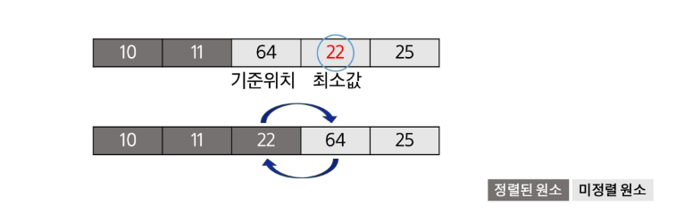
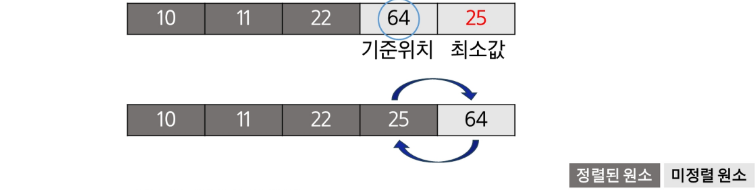

# 선택 정렬

- 주어진 자료들 중 가장 작은 값의 원소부터 차례대로 선택하여 위치를 교환하는 방식(오름차순)

### 정렬 과정

- 주어진 리스트 중에서 최소값을 찾기
- 그 값을 리스트의 맨앞에 위치한 값과 교환
- 맨 처음 위치를 제외한 나머지 리스트를 대상으로 위의 과정을 반복

### 자세한 과정

1. 주어진 리스트에서 최소값을 찾는다
2. 리스트의 맨앞에 위치한 값과 교환



3. 미 정렬 리스트에서 최소값을 찾는다
4. 리스트의 맨 앞에 위치한 값과 교환



5. 미정렬 리스트에서 최소값을 찾는다.
6. 리스트의 맨 앞에 위차한 값과 교환



7. 미정렬 리스트에서 최소값을 찾는다
8. 리스트의 맨 앞에위치한 값과 교환
   

- 미정렬 원소가 하나 남은 상황에선 마지막 원소가 가장 큰 값을 갖게 되므로 실행종료

```python
def selection_sort(a, N):
    for i in range(N - 1): # 정렬 구간의 시작 인덱스
        min_idx = i # 첫 원소를 최소로 가정
        for j in range(i + 1, N):

            if a[min_idx] > a[j]:# 최소 원소 위치 갱신
                min_idx = j
        a[i], a[min_idx] = a[min_idx], a[i] # 구간 최솟값을 구간 맨 앞으로
```

