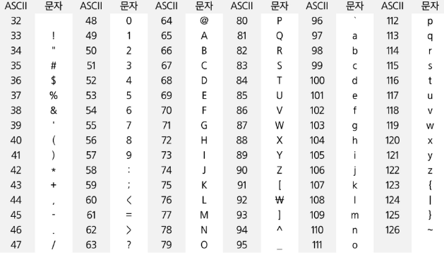
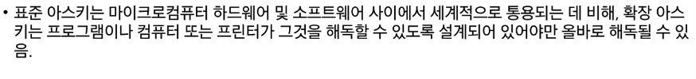
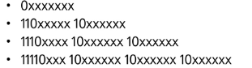
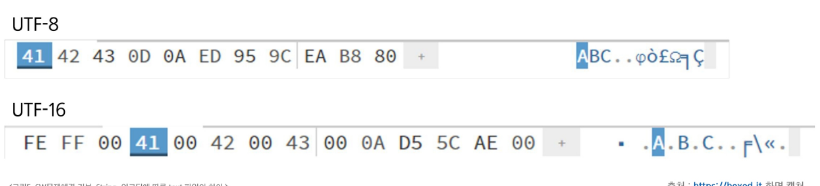

# 코드체계

- 문자에 대응되는 숫자를 정한 것

### 문제점
- 네트워크가 발전되기 전 미국의 각 지역 별로 코드체계를 정해 놓고 사용
- 내트워크가 발전하면서 서로 정보를 주고 받을 때 정보를 달리 해석한다는 문제발생

### 개선
- 혼동 예방을 표준안 만듬
- 미국에서 ASCII라는 문자 인코딩 표준이 제정됨
- ASCII는 7비트 인코딩으로 128문자 표현 및 33개의 출력 불가능한 제어 문자들과 공백을 비롯한 95개의 출력 가능한 문자들로 이루어짐

### ASCII 문자(32~126)


### 확장 아스키
- 표준 문자 이외의 악센트 문자 도형문자 특수문자 특수기호등 부가적인 문자를 128개로 추가
- 표준 아스키는 7비트를 사용 문자표현 
- 확장은 1바이트 내의 8비트를 모두 사용함으로써 추가적인 문자 표현 가능
- 컴퓨터 생산자와 소프트웨어 개발자가 여러가지 다양한 문자에 할당할 수 있도록 하고 있고 이렇게 할당된 확장 부호는 표쥰 아스키와 같이 서로 다른 프로그램이나 컴퓨터 사이에 교환되지못하도록함

  
### 확장 아스키 예

    - 가변길이 저장함
    
- 저장 예시

  

    
- UTF-16(windows,java)
    - 16~32비트(2바이트*2)
    
- UTF-32 (unix)
    - 32~32비트(4바이트 * 1)
    
### 인코딩에 따른 텍스트 파일의 차이
- text.txt에 다음과 같이 저장
```text
ABC
한글
```
- 인코딩 방식을 바꿔가며 저장된 파일을 16진수 편집기로 읽기

