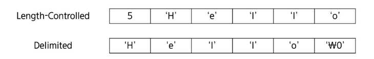
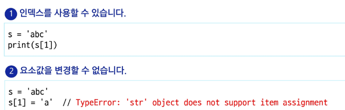
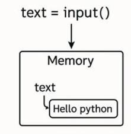

# 문자열

- 문자들이 순서대로 나열된 데이터

### 문자열의 분류
- Length-Controlled 문자열
    - 문자열의 길이 정보를 함께 저장해서 그 길이만큼 문자 데이터를 읽는 방식
    
- Delimited 문자열
    - 문자열의 끝을 나타내는 특정한 구분자가 있어서 구분자가 나올 때까지 문자열로 인식
    

### 🔹 파이썬 `str` 클래스 구조

* 문자열 객체는 길이 외에도 여러 정보를 함께 저장합니다.

  * **`PyObject_HEAD`**: 모든 Python 객체가 상속하는 공통 구조입니다.
  * **`length`**: 문자열의 길이를 나타냅니다.
  * **`hash`**: 문자열의 해시값으로, 딕셔너리의 키로 사용될 때 필요합니다.
  * **`interned`**: 같은 문자열을 관리하는 플래그입니다.
  * **`kind`**: 문자열 인코딩의 크기를 나타냅니다.
  * **`data`**: 문자열이 저장된 실제 메모리 주소를 가리키는 포인터입니다.

---

### 🔹 Python3에서의 문자열

* Python3에서는 텍스트 데이터의 취급 방법이 **통일**되어 있음

  * Python2와는 달리, 바이트 문자열과 Unicode 문자열 구분이 없습니다.
  * Unicode 기반으로 어떤 언어든 동일한 방식으로 문자열을 처리합니다.

- 문자열 기호

    -  `'` (홑따옴표), `"` (쌍따옴표), `'''` (홑따옴표 3개), `"""` (쌍따옴표 3개)

- 문자열 연산

    - **`+` 연결 (Concatenation)**
  문자열 + 문자열 : 이어 붙여주는 역할
  예시: `'ab' + 'c'` → `'abc'`

    - **`*` 반복 (Repetition)**
  문자열 \* 수 : 해당 수만큼 문자열을 반복
  예시: `'ab' * 3` → `'ababab'`

- 문자열은 데이터의 순서가 구분되는 시퀀스 자료형으로 분류
    - 시퀀스 자료형에서 사용할 수 있는 인덱싱 슬라이싱 연산 사용 가능
    

### 문자열 입력
- input() 함수로 읽기
- Hello python을 입력하면 빈칸을 포함해 한 행을 읽음
