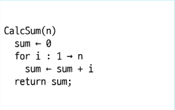
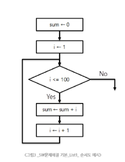
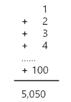
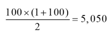
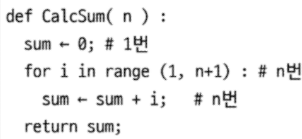
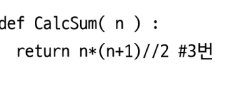
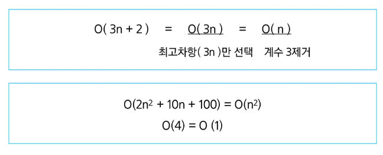
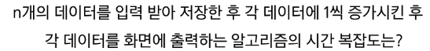

# 알고리즘 이란

- 문제를 해결하기 위한 절차나 방법

### 의사코드(슈도코드, Pseudocode)와 순서도
- 컴퓨터 분야에서 알고리즘을 표현하는 방법

 

### 알고리즘의 성능
-APS 과정의 목표 중 하나 : 보다 좋은 알고리즘을 이해하고 활용하기

- 좋은 알고리즘이란?

| 항목       | 설명                                           |
|------------|------------------------------------------------|
| **`정확성`**     | 얼마나 정확하게 동작하는가                     |
| 작업량     | 얼마나 적은 연산으로 원하는 결과를 얻어내는가 |
| 메모리 사용량 | 얼마나 적은 메모리를 사용하는가               |
| 단순성     | 얼마나 단순한가                               |
| 최적성     | 더 이상 개선할 여지없이 최적화되었는가        |

### 알고리즘의 성능
- 주어진 문제를 해결하기 위해여러 개의 다양한 알고리즘 가능
    - 어떤 알고리즘을 사용해야 하는가 고려
    
- 알고리즘의 성능 분석 필요
    - 많은 문제에서 성능 분석의 기준으로 알고리즘의 작업량 비교
    
### 예시
- 1부터 100까지 합을 구하는 문제

|알고리즘1 | 알고리즘2|
|--------|---------|
|||
|100번의 연산(덧셈 100번)|3번의 연산(덧셈1번,곱셈1번,나눗셈1번)|

### 알고리즘의 시간 복잡도

- 알고리즘의 작업량을 표현할 때 시간 복잡도로 표현
- 시간 복잡도(Time Complexity)
  - 실제 걸리는 시간 측정
  - 실행되는 명령문의 개수를 계산
  
### 예시
- 1부터 n까지 합을 구하는 문제

|알고리즘1 | 알고리즘2|
|--------|---------|
|||
|1+n*2 = 2n+1|3번의 연산|

### 시간 복잡도 표시
- 빅-오 표기법을 언급하는 경우가 많음
- 시간 복잡도 함수 중에서 가장 큰 영향력을 주는 n애 대한 항만을 표시
- 계수는 생략하여 표시

### 예시

> 정답 : O(n)