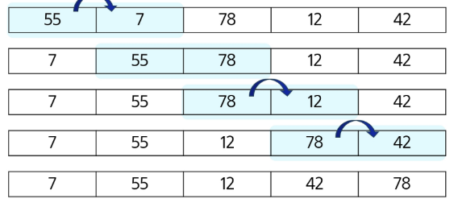
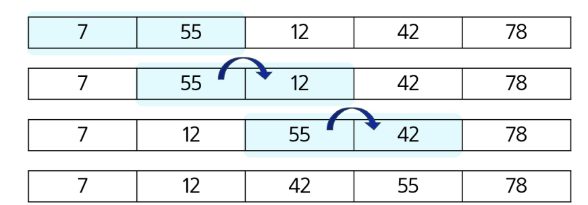
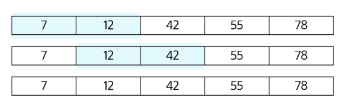
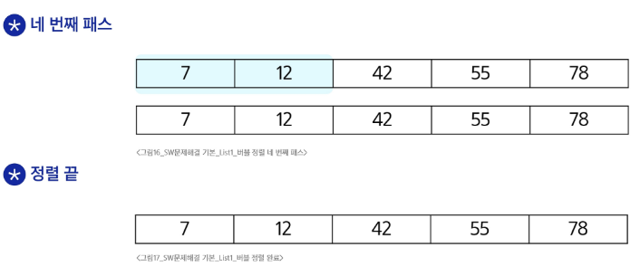

# 버블 정렬
- 인접한 두 개의 원소를 비교하며 자리를 계속 교환하는 방식

### 과정
1. 첫 번째 원소부터 인접한 원소끼리 계속 자리를 교환하면서 맨 마지막 자리까지 이동
2. 한 단계가 끝나면 가장 큰 원서가 마지막 자로 정렬
3. 교환하며 자리를 이동하는 모습 비유 버블정렬

- 1 pass


  
- 2pass


  
- 3pass


  
- 4pass



### 버블 정렬 알고리즘

```python
N = 5

def bubble_sort(a, N): # 정렬할 List, N 원소의 수
    for i in range(N-1,0,-1):  # 범위의 끝 위치
        for j in range(i): # 비교할 왼쪽 원소 인덱스 j
            if a[j]>a[j+1]:
                a[j],a[j+1] = a[j+1],a[j]
```