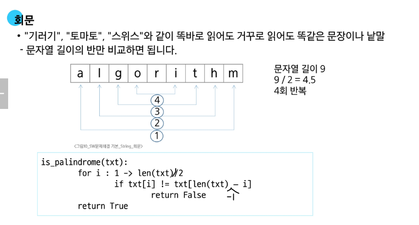

# 연산

### 문자열 뒤집기

- 문자열을 역순으로 재정의

```python

s = 'hello'
s = s[::-1]  # olleh
```

- 리스트로 변환 후 다시 문자열로 변환

```python
s = 'abcd'
s = list(s)
s.reverse()
s = ''.join(s)
```

### 회문

- '기러기', '토마토'와 같이 앞뒤 뒤집어도 똑같은 단어
- 문자 길이의 반만 비교하면됨
  

### 문자열 비교

- == : 값이 같은지 비교
- is : 동일객체인지 비교

### 사전 순서 비교

- 비교연산자 '<' 사용
- 유니코드 비교

```python
def my_strcmp(s1, s2):
    if s1 < s2:
        return -1
    elif s1 > s2:
        return 1
    else:
        return 0
```
### 문자열 숫자 int로 변환


