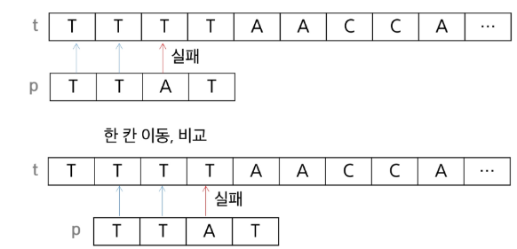
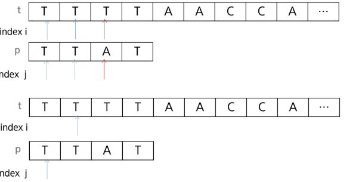

# 고지식한 알고리즘

- 단순한 방법
- 본문 문자열을 처음부터 끝까지 차례대로 순회하면서 패턴 내의 문자들을 일일이 비교하는 방식     
  

### 구현

- 본문의 비교위치 i, 패턴에서의 비교위치 j
- 일치하면 i,j증가, 실패하면 i는 이전 시작위치 다음으로 j는 맨 앞으로 초기화
  

### 코드

```python
def bruit_force(p, t):  # p : 찾을 패턴 t : 본문 문자열, 패턴이 있으면 인덱스 없으면 -1 리턴
    i = 0  # t의 인덱스
    j = 0  # p의 인덱스
    M = len(p)
    N = len(t)

    while j < M and i < N:
        if t[i] != p[j]:
            i -= j
            j = -1
        i += 1
        j += 1

    if j == M:
        return i - M
    else:
        return -1

```

## 문자열 매칭 알고리즘 비교


# 문자열 매칭 알고리즘 비교

| 구분                   | 내용                                                                                 |
|------------------------|--------------------------------------------------------------------------------------|
| 찾고자 하는 문자열 패턴 | 길이 m, 총 문자열 길이 n                                                             |
| 고지식한 패턴 검색 알고리즘 | 수행시간 O(mn)                                                                       |
| 카프-라빈 알고리즘        | 수행시간 Θ(n)                                                                         |
| KMP 알고리즘             | 수행시간 Θ(n)                                                                         |
| 보이어-무어 알고리즘       | - 앞의 두 매칭 알고리즘들은 텍스트 문자열의 문자를 적어도 한번씩 훑기 때문에 최선의 경우에도 O(n)입니다.  |
|                        | - 보이어-무어 알고리즘은 텍스트 문자를 다 보지 않아도 됩니다.                            |
|                        | - 패턴의 오른쪽부터 비교합니다.                                                        |
|                        | - 완전한 보이어-무어 알고리즘은 일치 접미부 휴리스틱을 함께 사용합니다.                   |
|                        | - 최악의 경우 O(mn)이지만 일반적으로 Θ(n)보다 시간이 덜 듭니다.                        |
|                        | - grep, VS Code, JVM 등에서 사용된다고 알려져 있습니다.                                |
