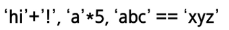

|개념|설명|예시|
|---|----|---|
|코드체계|문자를 숫자로 표현하는 체계|ASCII,Unicode|
|문자열|문자들이 순서대로 나열된 데이터|'ㅎㅇ',"hello"|
|문자열 연산|문자열에서의 덧셈(연결),곱셈(반복) 등||
|KMP 알고리즘|효율적 문자열 검색|LPS 배열을 이용해 건너뛰기|
|보이어-무어 알고리즘|뒤에서부터 검사하는 빠른 검색 알고리즘|불일치,접미어 휴리스틱 사용|
