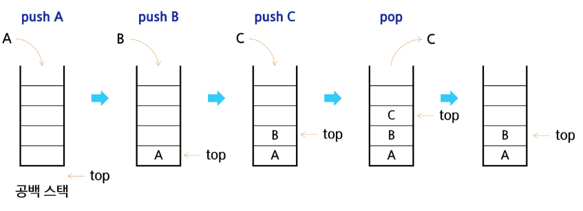

# stack

## 스택이란
- 물건을 싸항 올리듯 자료를 쌓아 올린 형태의 자료구조
- 대표적인 선형 자료구조의 하나로 1:1의 관계를 갖는다.

## 후입선출(LIFO)
- 가장 마지막에 넣은 자료가 가장 먼저 나오는 것

> [!TIP]
> 1,2,3 순서로 들어가면 3,2,1 순서로 나오게 되는것을 말함

## stack의 기본 연산
- 스택을 프로그램에서 구현하기 위해서 필요한 자료구조와 연산
    - 배열을 사용해 구현 가능
        - 파이썬에서는 리스트를 사용해 구현 가능
    - 저장소 자체를 스택이라 부르기도 함
        - 용도에 따라 메모리의 일부를 스택으로 부름
    - 스택에서 마지막 삽입된 원소의위치
        - 스택 포인터 top으로 부르며 데이터를 넣거나 뺄 때 기준이 되는 위치
    
## stack의 연산
- 삽입(push)
    - 저장소에 자료를 저장하는 연산
    
- 삭제(pop)
    - 저장소에서 삽입한 자료의 역순으로 꺼내는 연산
    
- 스택 공백 여부(isEmpty)
    - 스택이 비어있으면 True 아님 False
    
- 스택의 top에 있는 item을 반환(peek)
    - 삭제는 하지않음
    

### 스택의 삽입/삭제 과정
- 빈 스택에 원소 A,B,C를 차례로 push후 한번 pop하는 과정

  
