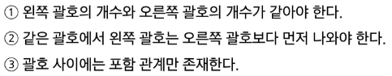
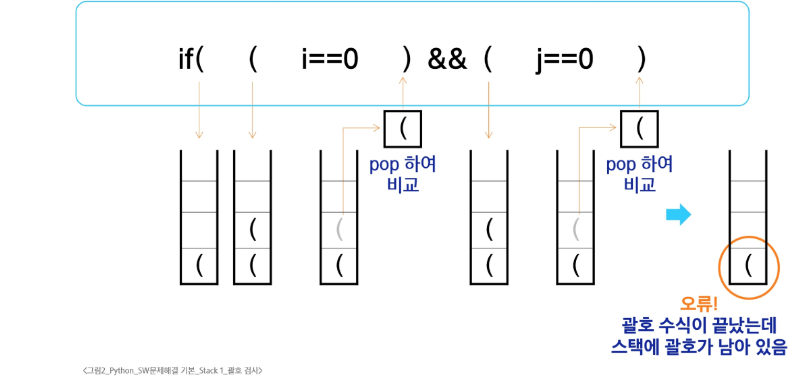

# 괄호검사

## 조건

### 스택을 이용한 괄호 검사

### 괄호 검사 알고리즘 개요

1. 문자열에 있는 괄호를 차례대ㅑ로 검사하면서 왼쪽 괄호를 만나면 스택에 삽입하고 오른쪽 괄호를 만나면 스택에서 top 괄호를 삭제한 후 오른쪽 괄호와 짝이 맞는지 검사
2. 이때, 스택이 비어있으면 조건 1 또는 조건 2에 위배되거 괄호의 짝이 맞지 않으면 조건 3에 위배
3. 마지막 괄호까지 조사한 후에도 스택에 괄호가 남아 있으면 조건 1에 위배