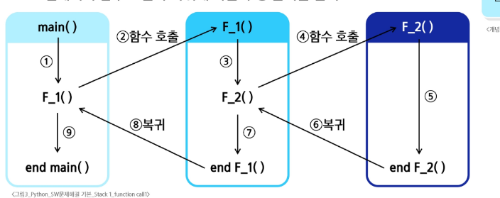
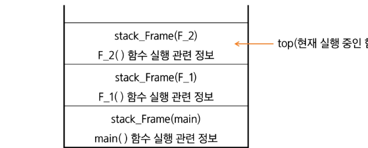
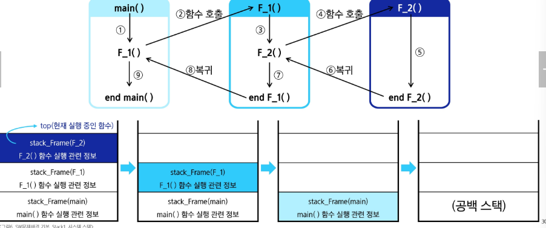

# function_call

- 프로그램에서의 함수 호출과 복귀에 따른 수행 순서를 관리

  
> [!IMPORTANT]
> 가장 마지막에 호출된 함수가 가장 먼저 실행을 완료하고 복귀하는 LIFO구조의 스택을 이용하여 수행순서 관리

### 시스템 스택
- 함수 수행에 필요한 지역변수 파라미터 및 수행 후 복귀할 주소 등의 정보를 저장
- 함수 호출이 발생하면 stack frame에 저장하여 시스템 스택에 삽입

  
### 프로그램에서의 함수 호출과 복귀에 따른 수행 순서를 관리
- 함수의 실행이 끝나면 시스템 스택의 top원소(스택 프레임)를 pop하면서 프레임에 저장되어 있던 복귀 주소를확인하고 복귀시킴
- 함수 호출과 복귀에 따라 이 과정을 반복하여 전체 프로그램 수행이 종료되면 시스템 스택은 공백 스택이 됨

### 시스템 스택을 이용한 함수 호출과 복귀

