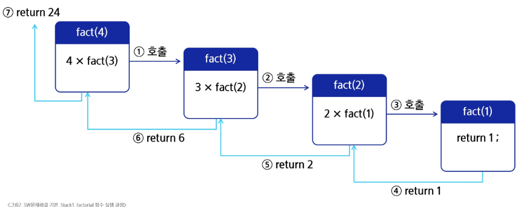
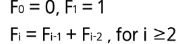
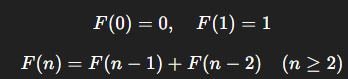
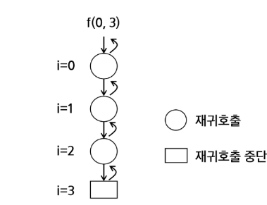
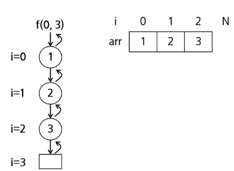
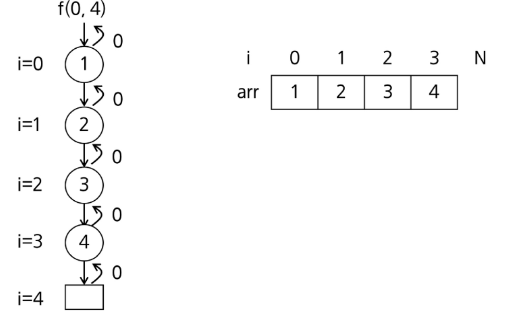
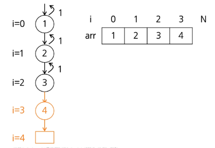

# 재귀호출

- 함수가 자신과 같은 작업을 반복해야 할 때 자신을 다시 호출하는 구조

### factorial 함수에서 n=4인 경우 실행 과정



### 피보나치 수열

- 0과1로 시작하고 이전의 두 수 합을 다음 항으로 하는 수열

> [!TIP]
> 0,1,1,2,3,5,8,13, ...

### 수학적 정의

- 피보나치 수열의 i번째 값을 계싼하는 함수 F를 정의
  

# 피보나치 수를 구하는 재귀함수

- 피보나치 수열의 수학적 정의에 따라 피보나치 수열의 i번째 항을 반환하는 함수를 재귀함수로 구현가능

설명드리겠습니다.

`else`에서 `return fibo(n - 1) + fibo(n - 2)`가 되는 이유는 **피보나치 수열의 정의 자체** 때문입니다.

---

### 1. 피보나치 수열의 수학적 정의

피보나치 수열(Fibonacci sequence)은 이렇게 정의됩니다.



즉, **앞의 두 항을 더한 값이 다음 항**이 됩니다.

---

### 2. 코드 해석

```python
def fibo(n):
    if n < 2:  # n이 0 또는 1이면 그대로 반환
        return n
    else:
        return fibo(n - 1) + fibo(n - 2)
```

* `n < 2`일 때는 더 이상 계산이 필요 없는 **기저 조건**입니다.

    * `n == 0 → return 0`
    * `n == 1 → return 1`
* 그 외(`n >= 2`)일 때는 **피보나치 정의에 따라**:

    * `F(n) = F(n-1) + F(n-2)`
    * 그래서 `fibo(n-1)`과 `fibo(n-2)`를 **재귀 호출**로 계산하고, 그 합을 반환합니다.

---

### 3. 예시로 살펴보기 (n=5)

```python
fibo(5)
= fibo(4) + fibo(3)
= (fibo(3) + fibo(2)) + (fibo(2) + fibo(1))
= ((fibo(2) + fibo(1)) + (fibo(1) + fibo(0))) + ((fibo(1) + fibo(0)) + 1)
= (((1 + 1) + (1 + 0)) + ((1 + 0) + 1))
= 5
```

계산 과정에서 계속 `n-1`과 `n-2`를 호출하는 이유가 바로 **정의가 그렇게 되어 있기 때문**입니다.

---

### 4. 정리

* `n-1`, `n-2`를 쓰는 이유 → 피보나치 수열의 공식 자체가 \*\*"앞 두 항의 합"\*\*으로 정의되어 있기 때문.
* `else` 구문은 이 수학적 정의를 그대로 코드로 옮긴 것.

### 재귀함수의 기본형

- 현재 호출 단계와 목표 단계를 인자로 사용
    - 현재 단계 i, 목표 N을 인자로 갖는 재귀함수 f(i,N)이 기본형



```python
def f(i, N):
    if i == N:  # 중단조건
        return
    else:
        f(i + 1, N)  # 재귀호출
```

### 모든 배열 원소에 접근하는 재귀함수

- 기본형 활용
    - 호출 단계 i 에서 arr[i] 원소에 접근하고, i가 배열의 크기와 같아지면 재귀호출 중단



```python
arr = [1, 2, 3]


def f(i, N):
    if i == N:  # 크기 N인 베열 arr[i]에 접근
        return
    else:
        print(arr[i])
        f(i + 1, N)  # 재귀호출
```

### 배열 원소 검색

- 배열에 v가있으면 1, 없으면 0을 리턴 하는 함수
    - v=5인 경우 arr에는 5가 없으므로 마지막 단계까지 호출 후 0 return



### v=3인경우

- 3을 찾은 경우 재귀 중단

```python
arr = [1, 2, 3, 4]


def f(i, N, v):
    if i == N:  # i값이랑 N번 인덱스 값이 같아진다는건 더이상 찾을게 없다는 뜻으로
        return 0  # 0 리턴

    elif arr[i] == v: # 만약 v값을 찾은 경우
        return 1 # 1을 리턴
    else:
        return f(i + 1, N, v) # 해당되지 않으면 i값이 증가하면서 재귀
```


