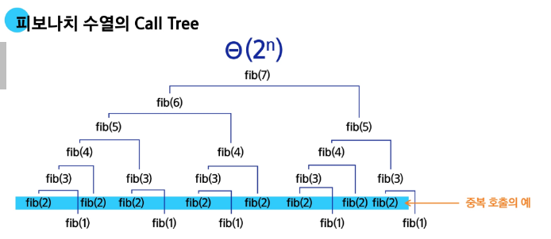

# Memoization

## 피보나치 제귀호출의 문제점

- 피보나치 수를 구하는 함수를 재귀함수로 구현한 알고리즘은 **엄청난 중복 호출이 존재**한다는 문제 발생




 ## 메모이제이션 이란
- 컴퓨터 프로그램을 실행할 때 이전에 계산한 값을 메모리에 저장해서 매번 다시 계산하지 않도록 하여 전체적인 실행속도를 빠르게 하는 기술

### 메모이제이션 적용한 피보나치
- 계산된 적이 있는 피보나치 수는 저장된 값을 리턴

```python
# memo를 위한 배열을 할당하고 모두 0으로 초기화
# memo[0]을 0으로 memo[1]는 1로 초기화

# 피보나치 수를 재귀로 구하되, 이전 계산 결과를 memo 배열에 저장하여 중복 계산을 방지하는 함수
def fibo1(n):
    # n이 2 이상이고, 아직 memo[n] 값이 계산되지 않았을 경우(0인 경우) 계산 수행
    if n >= 2 and memo[n] == 0:
        # memo[n-1]과 memo[n-2]를 재귀 호출로 구한 후 더하여 memo[n]에 저장
        memo[n] = fibo1(n - 1) + fibo1(n - 2)
    # 이미 계산된 값이 있으면 그대로 반환
    return memo[n]

# n번째 피보나치 수까지 저장할 수 있는 배열 memo를 생성하고 모두 0으로 초기화
# 예: n이 5라면 memo = [0, 0, 0, 0, 0, 0] (길이 n+1)
memo = [0] * (n + 1)

# 피보나치 수열의 초기값 설정: F(0) = 0
memo[0] = 0

# 피보나치 수열의 초기값 설정: F(1) = 1
memo[1] = 1


```

