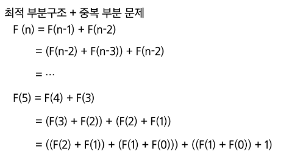

# DP(동적계획법)

- 입력 크기가 작은 부분 문제들을 먼저 해결한 뒤 그 결과를 바탕으로 더 큰 부분 문제를 순차적으로 해결해 나가며 최종적으로 전체 문제의 해답을 도출하는 알고리즘

### 피보나치 수열(DP 적용 뮨제)

- 문제의 최적 해가 그 하위 문제의 최적해로부터 쉽게 구성될 수 있는 최적 부분구조여야함
- 동일한 하위 문제가 여러 번 반복되어 나타는 중복 부분 문제여야함



### 피보나치 수열 함수의 중복 호출 제거

- 부분 문제로 나누는 일을 끝냈으면 가장 작은 부분 문제부터 해 구하기
- 그 결과는 테이블에 저장하고 테이블에 저장된 부분 문제의 해를 이용하여 상위 문제의 해를 구하기

| 테이블 인덱스 | 저장되어 있는 값 |
|--------------|-----------------|
| [0]          | 0               |
| [1]          | 1               |
| [2]          | 1               |
| [3]          | 2               |
| [4]          | 3               |
| ...          | ...             |
| [n]          | fibo(n)         |


### DP활용 로직

```python
def fibo2(n):
    # n번째 피보나치 수까지 저장할 리스트 f를 생성하고, 0으로 초기화
    # 예: n이 5라면 [0, 0, 0, 0, 0, 0] (길이 n+1)
    f = [0] * (n + 1)
    
    # 피보나치 수열의 첫 번째 값 초기화: F(0) = 0
    f[0] = 0
    
    # 피보나치 수열의 두 번째 값 초기화: F(1) = 1
    f[1] = 1
    
    # 2부터 n까지 반복하며, 각 항을 앞 두 항의 합으로 채움
    for i in range(2, n + 1):
        # 피보나치 공식: F(i) = F(i-1) + F(i-2)
        f[i] = f[i - 1] + f[i - 2]
    
    # n번째 피보나치 수 반환
    return f[n]

```

## 📌 DP(동적 계획법)의 구현 방식

* **Recursive 방식**: `fib1()`
* **Iterative 방식**: `fib2()`

---

## 💡 주요 내용

> 재귀 구조에 메모이제이션을 사용하는 것보다, 반복문(Iterative) 구조로 DP를 구현하는 방식이 **성능 면에서 더 효율적**임.
> 그 이유는 재귀 구조는 내부적으로 **시스템 호출 스택**을 사용하기 때문에 \*\*오버헤드(Overhead)\*\*가 발생하기 때문임.

---

### 🔍 용어 설명

* **Memoization**

  * 이미 계산한 값을 저장해, 같은 계산을 반복하지 않도록 하는 기법 (주로 재귀와 함께 사용)
* **Iterative 방식**

  * 반복문을 사용해 순차적으로 값을 계산하는 방식
* **오버헤드(Overhead)**

  * 추가적인 자원 소모나 처리 시간을 발생시키는 부가적인 비용
  * 예: 함수 호출 시 스택에 매개변수, 복귀 주소 등을 저장하고 꺼내는 과정에서 발생하는 시간·메모리 소모

---

## 📊 비교

| 방식               | 장점                      | 단점                                 |
| ---------------- | ----------------------- | ---------------------------------- |
| 재귀 + Memoization | 코드 구조가 간단, 정의 그대로 구현 가능 | 함수 호출 스택 오버헤드 발생, 깊은 재귀 시 스택 초과 위험 |
| 반복문 (Iterative)  | 성능 효율적, 스택 오버플로우 없음     | 코드가 재귀보다 직관성이 떨어질 수 있음             |

---

## 📝 결론

* **작은 n**에서는 차이가 미미하지만, **큰 n**에서는 반복문 방식이 더 빠르고 안정적입니다.
* 실전에서 DP 구현 시에는 **Iterative(반복문) 방식**을 우선 고려하는 것이 일반적입니다.

