# DFS(깊이 우선 탐색)

- 한 방향으로 가능한 깊게 탐색 후 더 이상 갈 곳이 없으면 되돌아와 다른 방향을 탐색

### 동작 원리
1. 시작 정점의 한 방향으로 갈 수 있는 경로가 있는 곳까지 깊이 탐색해 나감
2. 더 이상 갈 곳이 없게 되면 가장 마지막에 만났던 갈림길 간선이 있는 정점으로 되돌아와서 다른 방향의 정점으로 탐색을 계속 반복하여 결국 모든 정점을 방문

> [!IMPORTANT]
> 가장 마지막에 만났던 갈림길의 정점으로 되돌아가서 다시 깊이 우선 탐색을 반복해야 하므로 LIFO 구조 스택 사용

## 로봇이 선을 따라 모든 칸을 탐색하는 방법
1. 시작 정점 v를 결정하여 방문
2. 정점 v에 인접한 정점 중에서
    a. 방문하지 않은 정점w가 있으면 정점v를 스택에 push하고 정점 w를 방문한다 그리고 w를v로 하여 다시 2를 반복한다
    b. 방문하지 않은 정점이 없으면 탐색의 방향을 바꾸기 위해서 스택을 pop하여 받은 가장 마지막 방문 정점을 v로 하여 다시 2를 반복한다
   
3. 스택이 공백이 될때까지 2를 반복한다

### 1
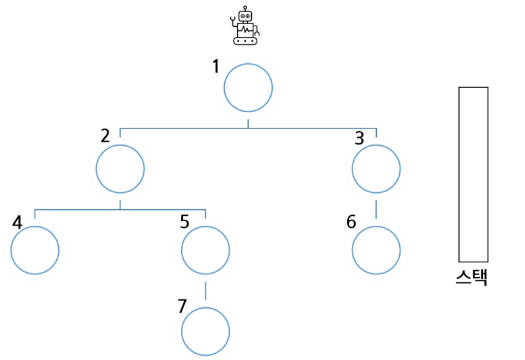
### 2
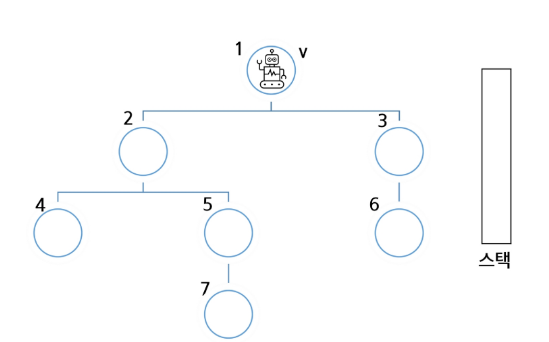
### 3
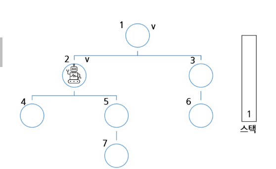
### 4
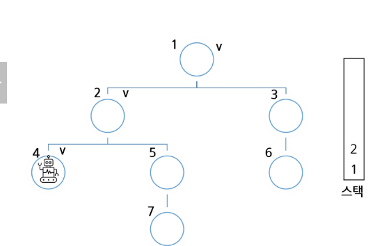
### 5
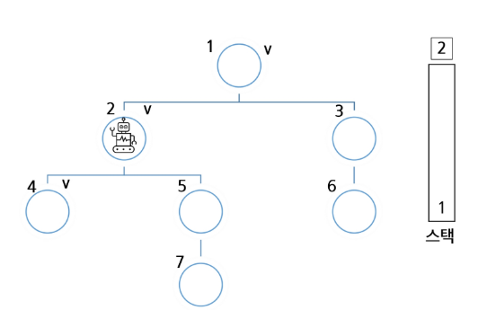
### 6
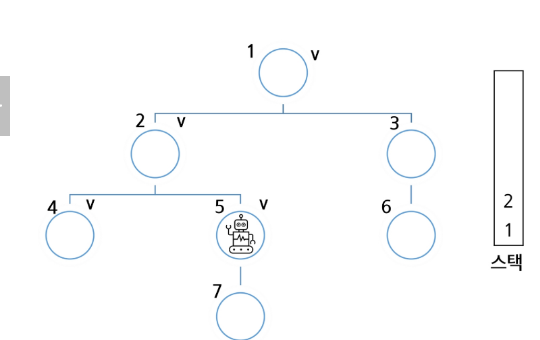
### 7
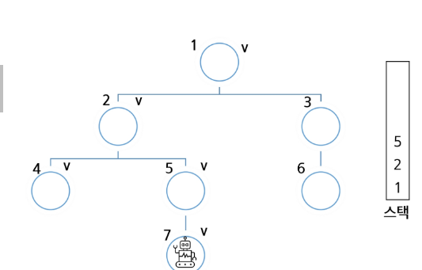
### 8
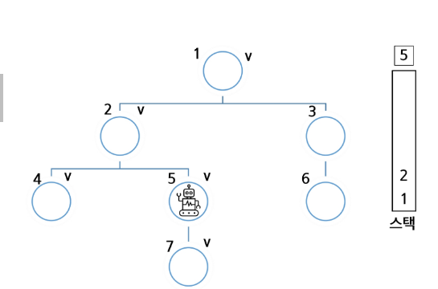
### 9
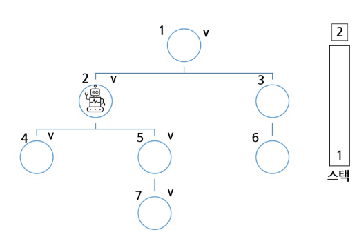
### 10
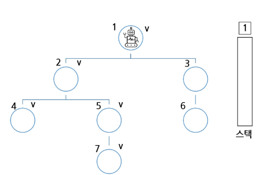
### 11
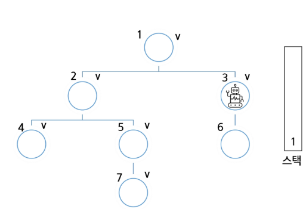
### 12
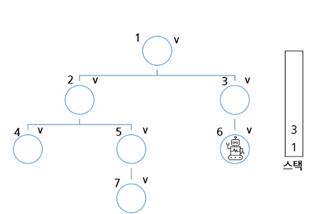
### 13

### 14

### 15
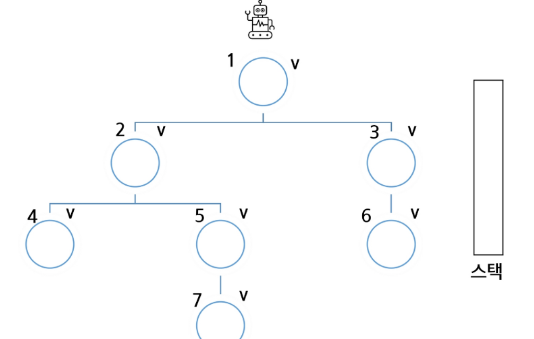

## DFS 알고리즘
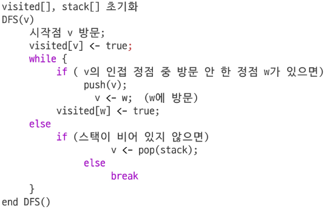

