# DFS예시

- 초기상태 : 배열visited를 False로 초기화 하고 공백 스택을 생성

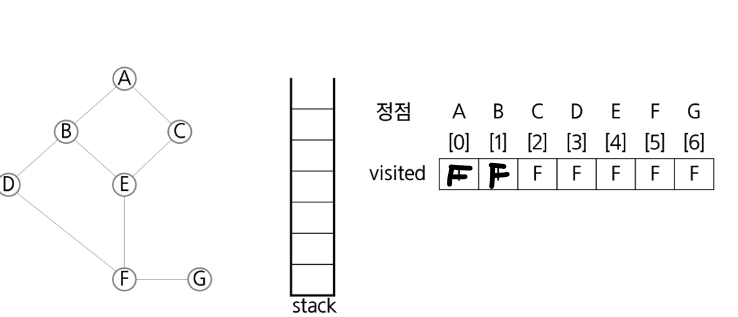

#### 1. 정점A를 시작으로 DFS 시작

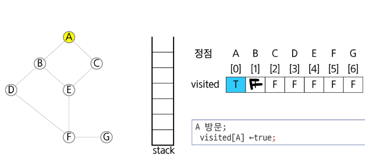

#### 2. 정점 A에 방문하지 않은 정점B,C가 있으므로 A를 스택에 push하고 인접 정점 B와 C 중에서 오름차순에 따라 B를 선택하여 탐색을 계속한다.

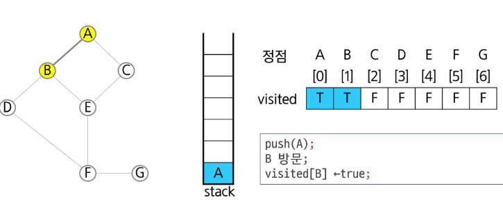

#### 3. 정점 B에 방문하지 않은 정점 D,E가 있으므로 B를 스택에 Push하고 인접 정점 D와 E중에서 오름차순에 따라 D를 선택하여 탐색 계속한다.

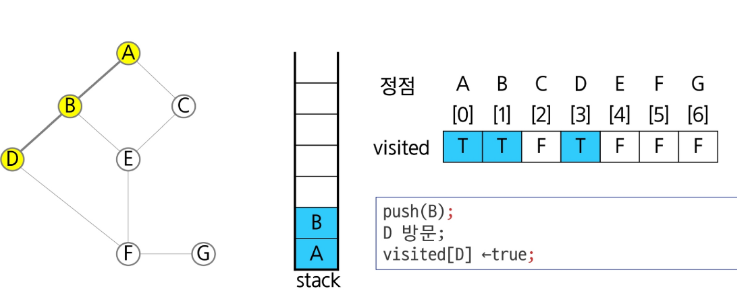

#### 4. 정점 D에 방문하지 않은 정점 F가 있으므로 D를 스택에 push하고 인접 정점 F를 선택하여 탐색을 계속한다.

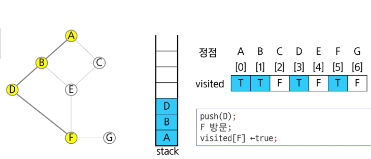

#### 5. 정점 F에 방문하지 않은 정점 E,G가 있으므로 F를 스택에 push하고 인접 정점 E,G를 선택하여 오름차순에 따라 E를 선택하여 탐색을 계속한다.

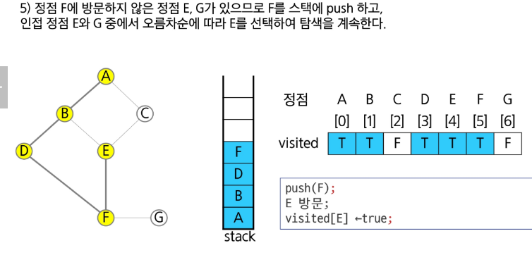

#### 6. 정점 E에 방문하지 않은 정점 C가 있으므로 E를 스택에 push하고 인접 정점 C를 선택하여 탐색을 계속한다.

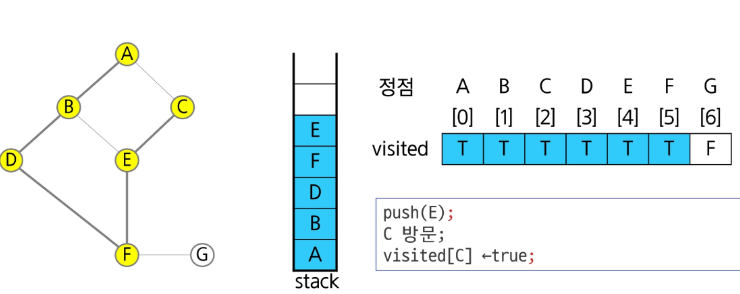

#### 7. 정점 C에 방문하지 않은 정점이 없으므로, 마지막 정점으로 돌아가기 위해 스택을 pop 하여 받은 정점 E에 대해서 방문하지 않은 인접 정점이 있는지 확인한다

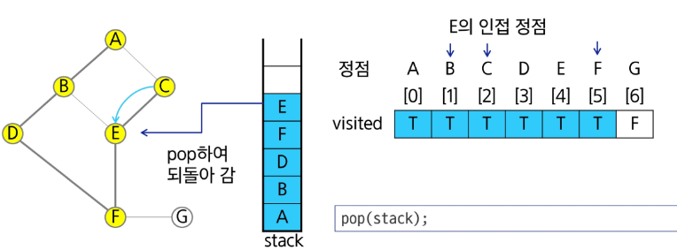

#### 8. 정점 E에 방문하지 않은 정점이 없으므로, 다시 스택을 pop 하여 받은 정점 F에 대해서 방문하지 않은 인접 정점이 있는지 확인

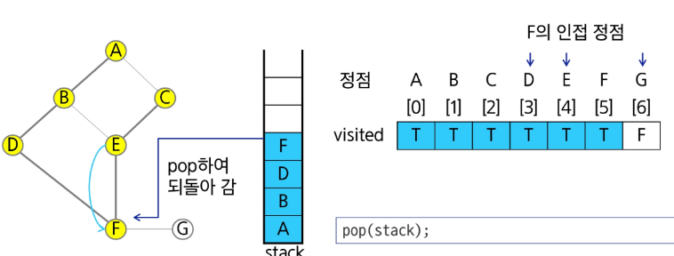

#### 9. 정점 F에 방문하지 않은 정점 G가 있으므로 F를 스택에 push하고 인접 정점 G를 선택하여 탐색을 계속한다.

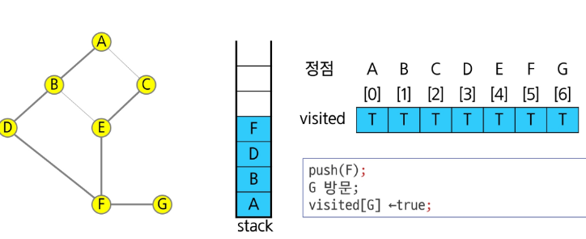

#### 10. 정점 G에 방문하지 않은 정점이 없으므로, 마지막 정점으로 돌아가기 위해 스택을 pop 하여 받은 정점 F에 대해서 방문하지 않은 인접 정점이 있는지 확인한다

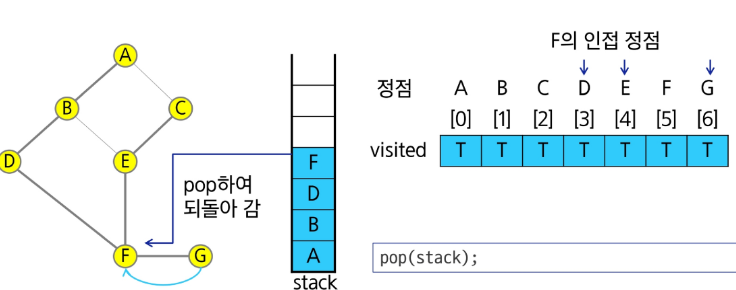

#### 11. 정점 F에 방문하지 않은 정점이 없으므로, 마지막 정점으로 돌아가기 위해 스택을 pop 하여 받은 정점 D에 대해서 방문하지 않은 인접 정점이 있는지 확인한다

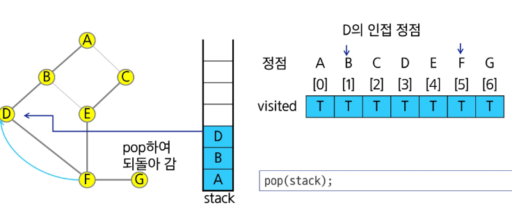

#### 12. 정점 D에 방문하지 않은 정점이 없으므로, 마지막 정점으로 돌아가기 위해 스택을 pop 하여 받은 정점 B에 대해서 방문하지 않은 인접 정점이 있는지 확인한다

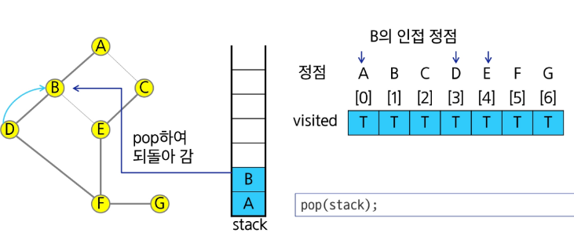

#### 13. 정점 B에 방문하지 않은 정점이 없으므로, 마지막 정점으로 돌아가기 위해 스택을 pop 하여 받은 정점 A에 대해서 방문하지 않은 인접 정점이 있는지 확인한다

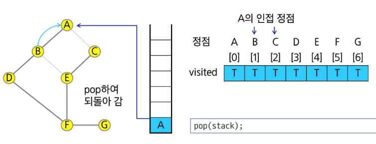

#### 14. 정점 A에 방문하지 않은 정점이 없으므로, 마지막 정점으로 돌아가기 위해 스택을 pop하는데 스택이 공백이므로 DFS 종료
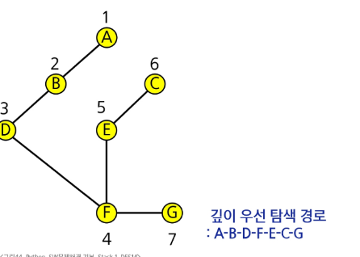

