# 후위 표기법 변환

### 문자열로 된 계산식

- stack을 이용하여 값을 계산할 수 있음
- 문자열 수식 계산의 일반적인 방법
    - **중위 표기법**의 수식을 후위 표기법으로 변경(stack 이용)
    - **후위 표기법**의 수식을 stack이용 계산

> [!TIP]
> 중위표기법 : 연산자를 피연산자의 가운데 표기 방법 예 : A+B
> 후위표기법 : 연산자를 피연산자 뒤에 표기하는 방법 예 : AB+

### step1 중위 표기법의 후위 표기법 변환 방법 1

1. 수식의 각 연산자에 대해서 우선순위에 따라 괄호 사용하여 다시 표현
2. 각 연산자를 그에 대응하는 오른쪽 괄호의 뒤로 이동
3. 괄호를 제거

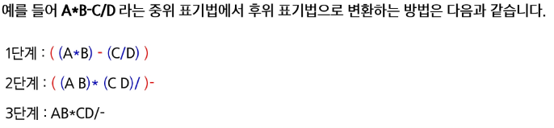

### step1 중위 표기법의 후위 표기법 변환 방법 2(알고리즘 -stack 이용)

1. 입력 받은 중위 표기법에서 토큰을 읽는다
2. 토큰이 피연산자면 토큰을 출력한다
3. 토크닝 연산자(괄호포함)일 때

    - 이 토큰이 스택의 top에 저장되어 있는 연산자보다 우선순위가 높으면 stack push
    - 그렇지 않다면 스택 top에 연산자의 우선순위가 토큰의 우선순위보다 작을 때까지 스택에서 pop한 후 토큰의 연산자를 push 만약 top에 연산자가 없으면 push

4. 토큰이 오른쪽 괄호 `)`이면 스택 top에 왼쪽 괄호 `(`가 올 때까지 스택에 pop 연산을 수행하고 pop 한 연산자를 출력한다.  
   왼쪽 괄호를 만나면 pop만 하고 출력하지는 않는다.

5. 중위 표기법에 더 읽을 것이 없다면 중지하고, 더 읽을 것이 있다면 1부터 다시 반복한다.

6. 스택에 남아 있는 연산자를 모두 pop하여 출력한다.

    - **스택 밖의 왼쪽 괄호**는 우선 순위가 가장 높으며, **스택 안의 왼쪽 괄호**는 우선 순위가 가장 낮다.

### 후위 표기법 변환

- 변환할 중위 표기법으로 표현된 수식
  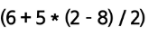

### 표기법 변환 설명 개요

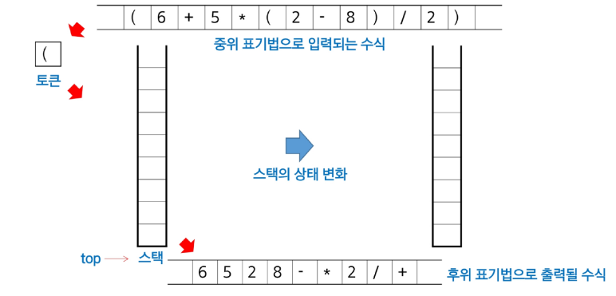

### 후위 표기법 변환 1

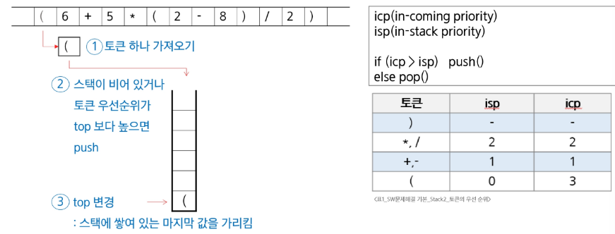

### 후위 표기법 변환 2

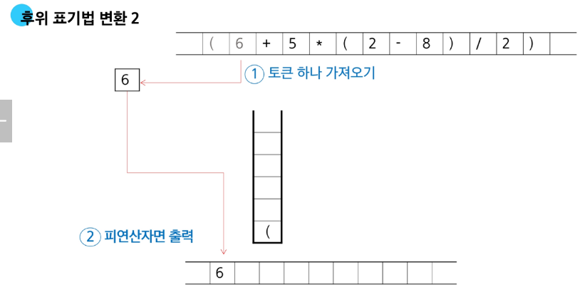

### 후위 표기법 변환 3

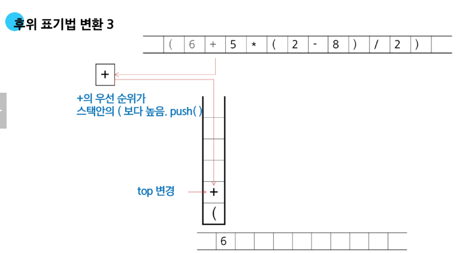

### 후위 표기법 변환 4

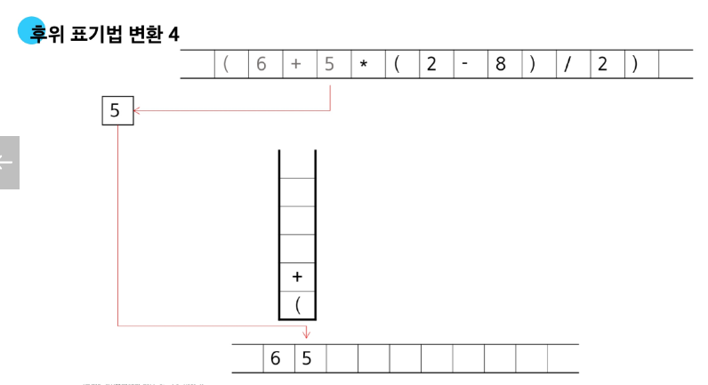

### 후위 표기법 변환 5

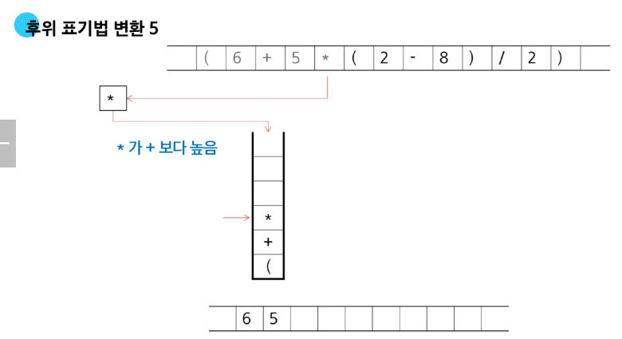

### 후위 표기법 변환 6

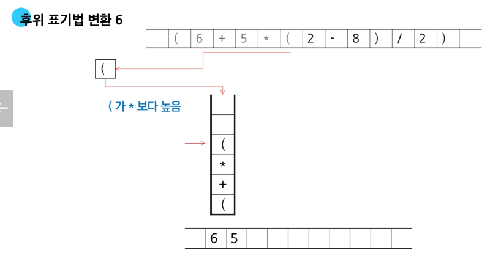

### 후위 표기법 변환 7

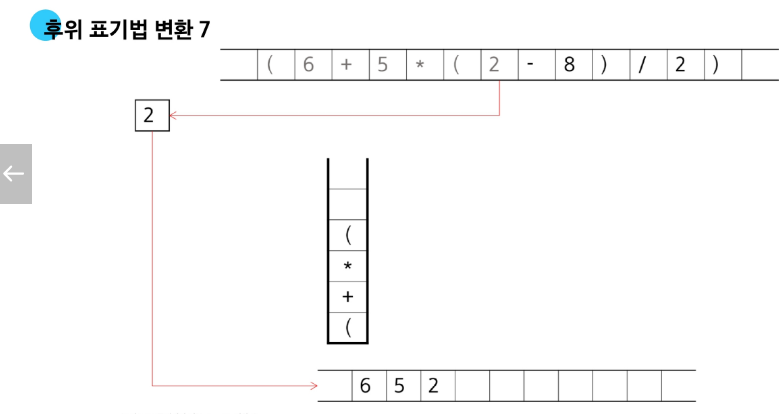

### 후위 표기법 변환 8

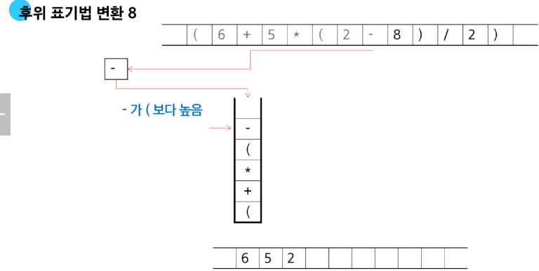

### 후위 표기법 변환 9

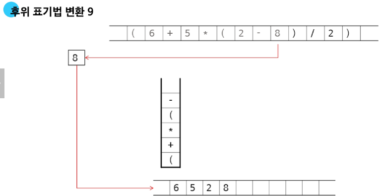

### 후위 표기법 변환 10

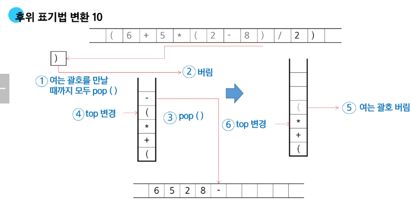

### 후위 표기법 변환 11

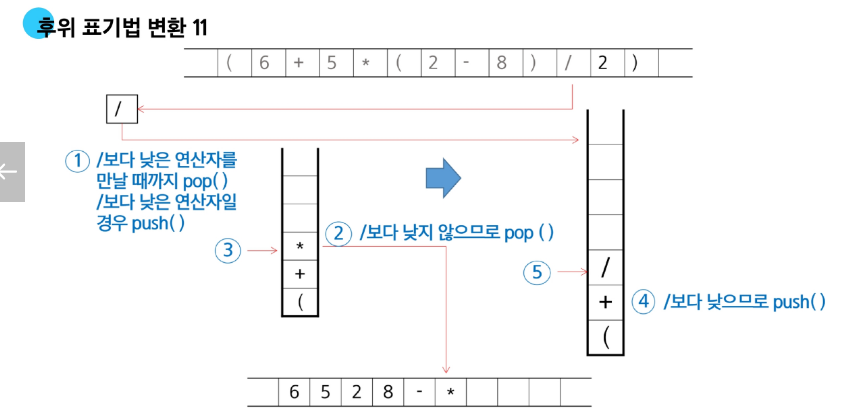

### 후위 표기법 변환 12

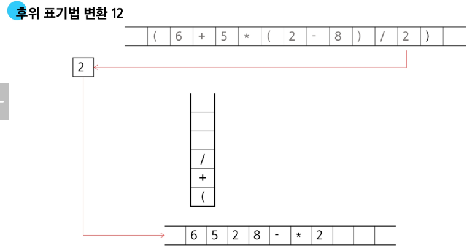

### 후위 표기법 변환 13

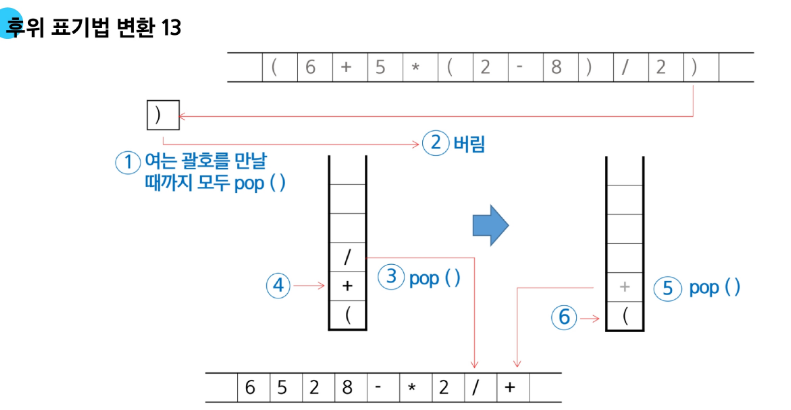

### 후위 표기법 변환 14

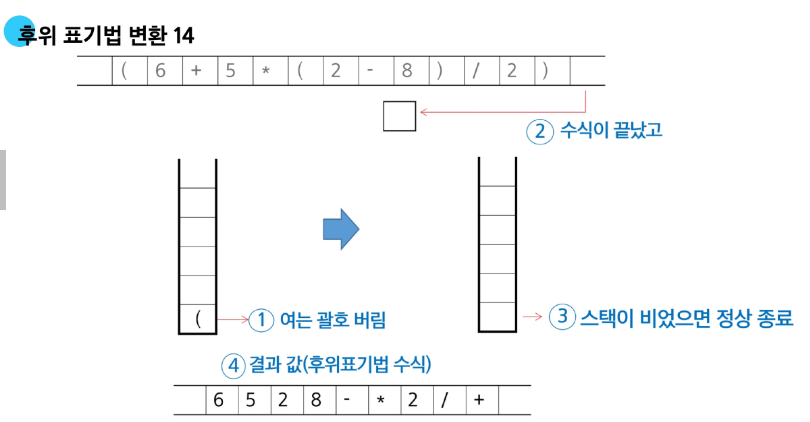