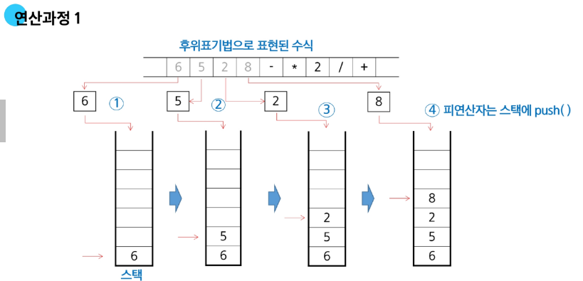
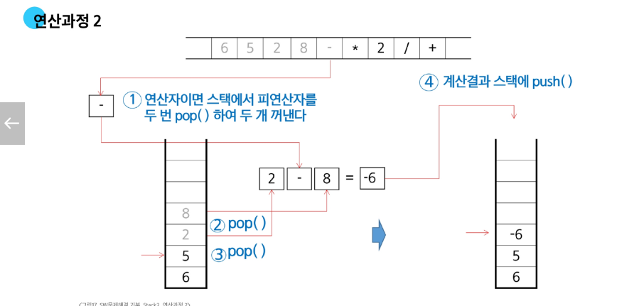
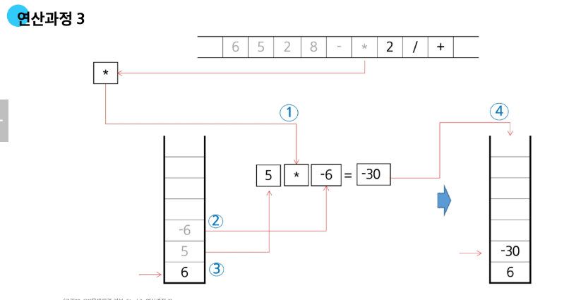
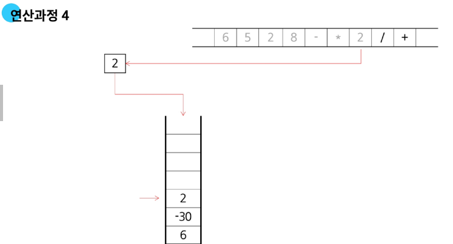
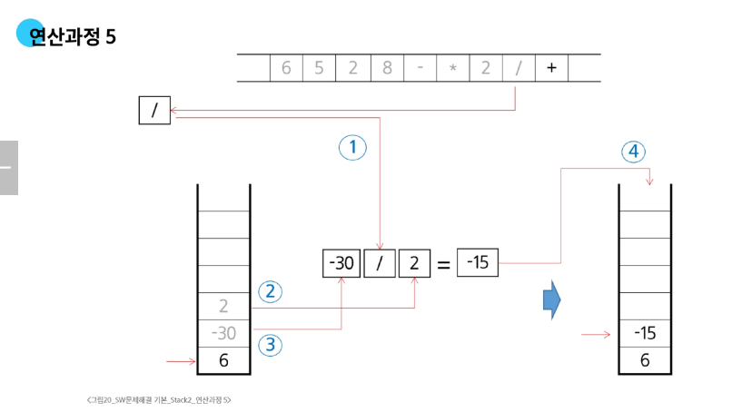
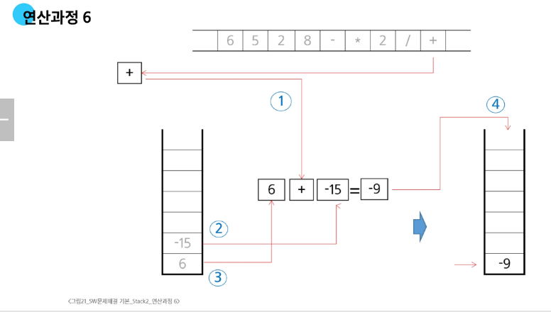
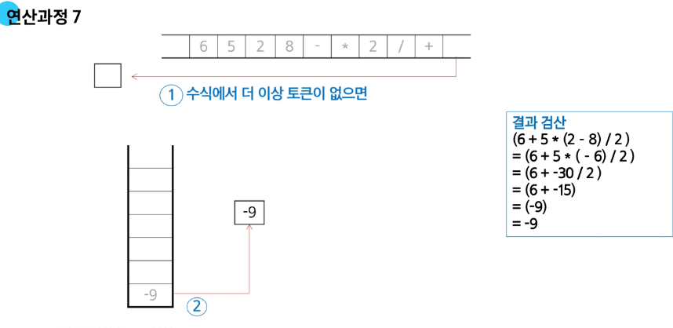

# 후위 표기법 연산
### step2 후위 표기법 식을 stack을 이용하여 계산
1. 피연산자를 만나면 스택에 push한다
2. 연산자를 만나면 필요한 만큼의 피연산자를 스택에서 pop하여 연산하고 연산결과를 다시 스택에 push한다
3. 수식이 끝나면 마지막으로 스택을 pop하여 출력한다

### 연산과정 1

### 연산과정 2

### 연산과정 3

### 연산과정 4

### 연산과정 5

### 연산과정 6

### 연산과정 7
