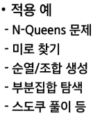
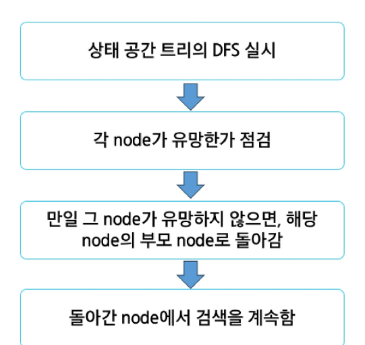
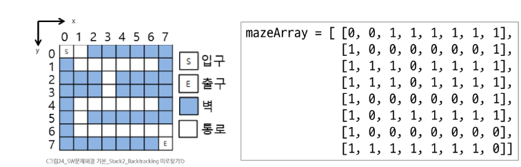
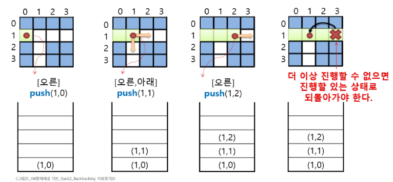
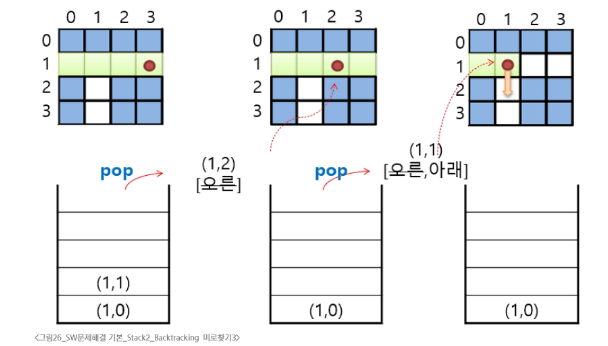
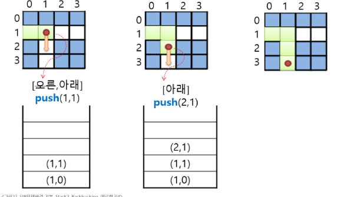

# Backtracking

- 후보해를 구성해 나가다가 더 이상 해가 될 수 없다고 판단되면 되돌아가서 다른 경로를 시도하는 방ㅂ법
- 문제 해결을 위한 탐색 알고리즘의 하나
- 가능성이 없는 경로는 더 이상 탐색하지 않고 되돌아가며 해결책을 찾는 방식
- 최적화 문제와 결정 문제에 적용
  

### DFS과의 차이점

- 가지치기 유무
    - 백트레킹은 어떤 node에서 출발하는 경로가 해결책으로 이어질 것 같지 않으면 더 이상 그 경로를 따라가지 않고 시도를 줄임

- 조기 경로 차단
    - DFS는 모든 경로 추척하지만 백트레킹은 불필요한 경로를 조기에 차단

- 경우의 수가 많은 경우
    - 예를 들어 N! 인 경우의 수를 가진 문제에 대해 DFS를 가하면 처리가 불가능
    - 백트레킹 적용하면 일반적으로 경우의 수가 줄어들지만 최악의 경우 지수함수시간을 요함으로 처리가 불가능

### 백트레킹 기법

- 어떤 노드의 유망성을 점검한 후에 유망하지 않다고 결정되면 그 노드의 부모로 되돌아가 다음자식노드로 이동
- 어떤 노드를 방문하여을때 그 노드를 포함한 경로가 해답이 될 수 없으면 그 노드는 유망하지 않다고 하며 반대로 해답의 가능성이 있음 유망하다고 판단
- 가지치기 : 유망하지 않는 노드가 ㅍ포함되는 경로는 더 이상 고려하지 않음

### 진행절차



### 미로찾기란


> 그림과 같이 입구와 출구가 주어진 미로에서 입구부터 출구까지의 경로를 찾는 문제 이동방향 4방향 제한 아래는 제공해주신 그림의 **스택 push / pop 흐름**을 그대로 따라가도록 만든 **미로 탐색(Backtracking, DFS‑스택)** 파이썬 예시입니다.

* 방향 우선순위는 그림처럼 **오른쪽 → 아래 → 왼쪽 → 위**로 탐색합니다.
* 스택에 좌표를 `push`하며 진행하고 더 이상 갈 수 없으면 `pop`으로 **되돌아가기**를 수행합니다.
* **라인별 주석**을 자세히 달았고, **추적 로그**를 출력해 그림의 단계와 1:1로 대응됩니다.
* 표준 라이브러리 `import` 없이 동작합니다.

---




## 예시 미로와 좌표 체계

* 좌표는 `(행, 열)`
* `0 = 통로`, `1 = 벽`
* 예시는 4×4 미로이며 **시작 = (1, 0)**, **도착 = (3, 3)** 으로 설정
* 아래 미로는 그림처럼 **가로로 먼저 밀고** 막히면 **아래로 내리는** 패턴을 보여줍니다.

```text
행\열  0 1 2 3
0     [1 0 0 0]
1     [0 0 0 1]
2     [1 1 0 1]
3     [1 1 0 0]
```

---

## 파이썬 코드 (라인별 주석 포함, 추적 로그 출력)

```python
# 미로(0=통과 가능, 1=벽). 그림 흐름을 재현하기 위해 오른쪽으로 밀다가 막히면 내려가는 구조
maze = [
    [1, 0, 0, 0],
    [0, 0, 0, 1],
    [1, 1, 0, 1],
    [1, 1, 0, 0],
]

# 시작과 도착 좌표 (그림 단계에 맞춰 시작을 (1,0)으로 둠)
start = (1, 0)
goal = (3, 3)

# 방향 우선순위: 오른쪽, 아래, 왼쪽, 위 (그림 흐름과 동일)
# 각 항목은 (행증가량, 열증가량)
dirs = [(0, 1), (1, 0), (0, -1), (-1, 0)]
dir_name = ["오른", "아래", "왼", "위"]  # 추적 로그에 방향 한글로 표기

# 방문 여부를 기록할 2차원 배열
visited = [[0] * len(maze[0]) for _ in range(len(maze))]

# 스택에는 (행, 열, 다음에 시도할 방향 인덱스) 형태로 저장하여
# pop 후 복귀 시 이어서 다른 방향을 시도할 수 있도록 한다.
stack = []


def in_range(r, c):
    """미로 범위 내인지 확인"""
    return 0 <= r < len(maze) and 0 <= c < len(maze[0])


def can_go(r, c):
    """해당 칸이 통로이고 아직 방문하지 않았는지 확인"""
    return in_range(r, c) and maze[r][c] == 0 and visited[r][c] == 0


# 시작 초기화: 시작 칸이 통로여야 탐색 가능
sr, sc = start
gr, gc = goal
if maze[sr][sc] == 1:
    print("시작 위치가 벽입니다. 경로 없음")
else:
    # 시작을 방문 표시하고 스택에 push
    visited[sr][sc] = 1
    stack.append([sr, sc, 0])  # 0번 방향부터 시도
    print(f"push{start}")

    found = False  # 목표 도달 여부

    # 스택이 빌 때까지 반복
    while stack:
        r, c, d = stack[-1]  # 스택 top을 들여다봄(현재 위치와 다음 시도 방향)

        # 목표에 도달했는지 체크
        if (r, c) == (gr, gc):
            found = True
            break

        # 현재 칸에서 d 인덱스 방향부터 차례로 시도
        if d >= 4:
            # 4가지 방향을 모두 시도했는데 갈 곳이 없다면 되돌아가기(pop)
            stack.pop()
            print(f"pop({r},{c})")
            # 되돌아온 위치의 top이 있다면, 그 top의 '다음 시도 방향'을 +1로 올려
            # 이어서 다른 방향을 바로 시도할 수 있게 한다.
            if stack:
                stack[-1][2] += 1
            continue

        # 아직 시도하지 않은 방향이 있다면 하나 시도
        dr, dc = dirs[d]
        nr, nc = r + dr, c + dc

        if can_go(nr, nc):
            # 이동 가능하면 방문 표시 후 push
            visited[nr][nc] = 1
            stack.append([nr, nc, 0])  # 새 칸에서는 다시 0번 방향부터 시도
            # 추적 로그: 어떤 방향으로 이동했는지 간단히 표기
            print(f"push({nr},{nc}) [{dir_name[d]}]")
        else:
            # 못 가면 현재 top의 다음 방향을 시도하기 위해 d를 1 증가
            stack[-1][2] += 1

    # 결과 출력
    if found:
        print("도착에 성공했습니다. 경로를 출력합니다.")
        # 스택에 남아 있는 것이 실제 경로(시작~도착)
        path = [(r, c) for r, c, _ in stack]
        print(" -> ".join(f"({r},{c})" for r, c in path))
    else:
        print("도착에 실패했습니다. 경로가 존재하지 않습니다.")
```

---

## 코드 흐름 요약

1. **스택에 시작 좌표 push**

    * `push(1,0)`처럼 로그로 확인
2. **오른쪽 → 아래 → 왼쪽 → 위** 순으로 **갈 수 있는지 검사**

    * 가능하면 `visited=1`로 표시하고 **push**
    * 불가능하면 **다음 방향**을 시도
3. **네 방향 모두 실패** 시 **pop**으로 **되돌아감**

    * 되돌아온 칸에서 **다음 방향 인덱스**를 올려 다른 길 시도
4. 도착 좌표를 만나면 성공

    * **스택에 남은 좌표들이 경로**이므로 그대로 출력

---

## 출력 예시 형태

* 진행 중 로그 예

  ```
  push(1,0)
  push(1,1) [오른]
  push(1,2) [오른]
  pop(1,2)
  pop(1,1)
  push(2,1) [아래]
  ...
  ```
* 최종 경로 예

  ```
  도착에 성공했습니다. 경로를 출력합니다.
  (1,0) -> (1,1) -> (1,2) -> (2,2) -> (3,2) -> (3,3)
  ```

