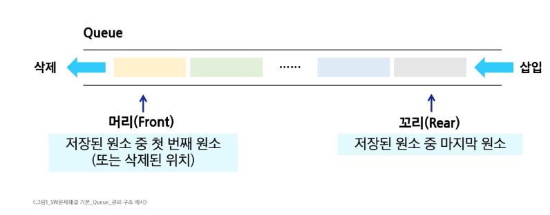
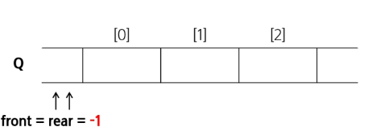
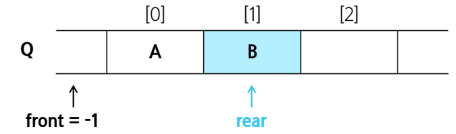
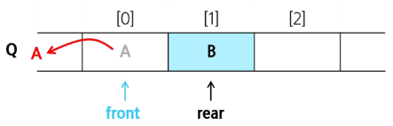
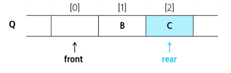
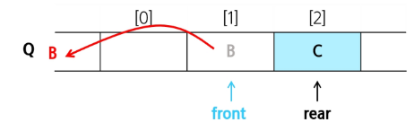
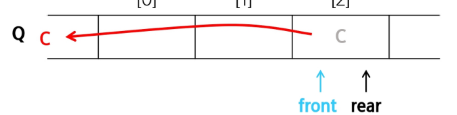

# 큐

- 먼저 들어온 데이터가 먼저 나가는 선형 자료구조

## 선입선출
- First In First Out
- 가장 먼저 넣은 자료가 가장 먼저 나오는 것

### 큐의 구조

### 큐의 기본 연산
- 삽입 : enqueue
- 삭제 : dequeue

| 연산            | 기능                                                   |
|-----------------|------------------------------------------------------|
| enqueue(item)   | 큐의 뒤쪽(rear 다음)에 원소를 삽입하는 연산            |
| dequeue()       | 큐의 앞쪽(front)에서 원소를 삭제하고 반환하는 연산      |
| create_queue()  | 공백 상태의 큐를 생성하는 연산                         |
| is_empty()      | 큐가 공백상태인지 확인하는 연산                        |
| is_full()       | 큐가 포화상태인지 확인하는 연산                        |
| qpeek()         | 큐의 앞쪽(front)에서 원소를 삭제 없이 반환하는 연산     |

## 큐의 연산 과정
1. 공백 큐 생성 : create_queue()

   
2. 원소 A 삽입 : enqueue(A)

   
3. 원소 B 삽입 : enqueue(B)

   
4. 원소 반환/삭제 : dequeue()

   
5. 원소 C 삽입 : enqueue(C)

6. 원소 반환/삭제 : dequeue()

7. 원소 반환/삭제 : dequeue()

   

