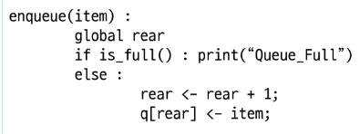
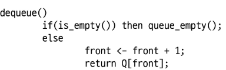
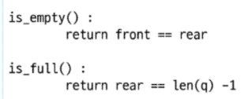

 # 선형큐
 
- 데이터를 일렬로 저장하며 앞에서 꺼내고 뒤에 넣는 기본 큐 구조

## 구현
- 배열이나 연결형 리스트로 구현
- 큐의 크기는 배열 크기와 동일
- front : 가장 최근에 삭제된 원소의 인덱스
- rear : 마지막으로 저장된 원소의 인덱스

### 상태표현
- 초기상태 : `front = rear = -1`
- 공백상태 : `front == rear`
- 포화상태 : `rear == n-1`(n:배열의 크기, n-1 : 배열의 마지막 인덱스)

## 선형 큐의 구현 - 1. 초기 공백 큐 생성 = create_queue()
- 크기 n인 1차원 배열 생성
- front 와 rear 를 -1로 초기화

  
## 선형 큐의 구현 - 2. 삽입 : enqueue(item)
- 마지막 원소 뒤에 새로운 원소를 삽입하기 위해
    1. rear값을 하나 증가시켜 새로운 원소를 삽입할 자리를 지정
    2. 그 인덱스에 해당하는 배열원소 Q[rear]에 item 저장
    

## 선형 큐의 구현 - 3. 삭제 : dequeue()
- 가장 앞에 있는 원소를 삭제하기위해
    1. front 값을 하나 증가시켜 큐에 남아있는 첫번째 원소 이동
    2. 새로운 첫번째 원소를 리턴 함으로써 삭제와 동일한 기능

## 선형 큐의 구현 - 4. 공백상태 및 포화상태 검사 : is_empty() , is_full()
- 공백상태 : front == rear
- 포화상태 : rear == n-1 (n:배열의 크기, n-1 : 배열의 마지막 인덱스)

## 선형 큐의 구현 - 5. 검색 : qpeek()
- 가장 앞에 있는 원소를 검색하여 변환하는 연산
- 현재 front의 한자리뒤에 이쓴ㄴ 원소 즉 큐의 첫번째에 있는 원소를 반환

