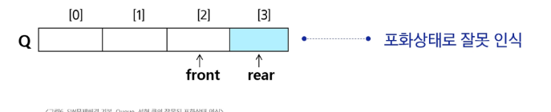
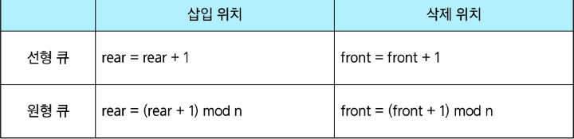
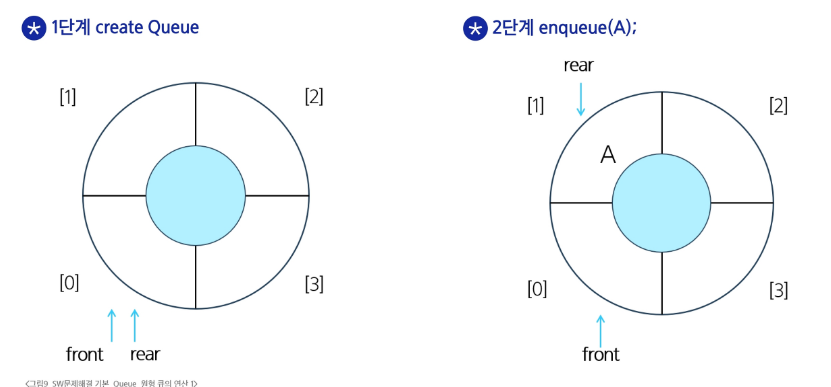
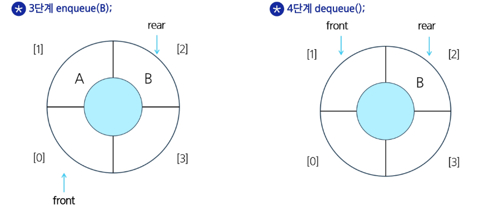
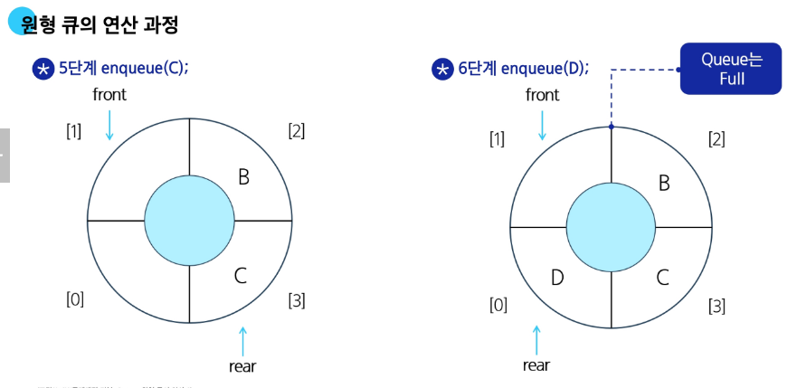

# 원형 큐

### 선형 큐 이용시의 문제점

- 잘못된 포화상태 인식
  

> [!WARNING]
> 선형 큐를 이용하여 원소의 삽입과 삭제를 계속할 경우 배열의 앞부분에 활용할 수 있는 공간이 있음에도 불구학 rear = n -1인 상태 즉 포화상태로 인식하여 더 이상의 삽입을 수행하지 않음

- 해결방법 으로는 매 연산시 저장된 원소들을 배열의 앞부분으로 모두이동 하는 방법이 있음

> [!CAUTION]
> 그러나 이 방법은 원소 이동에 많은 시간이 소요되어 큐의 효율성 떨어짐

## 원형큐란?

- 선형큐의 공간 낭비를 막기위해 처음과 끝이 연결된구조

### 원형 큐의 구조

- 초기 공백 상태 : `front = rear = 0`
- index의 순환
    - front와 rear의 위치가 배열의 마지막 인덱스인 n-1을 가리킴
    - 그 다음엔 논리적 순환을 이루어 배열의 처음 인덱스인 0으로 이동해야함
    - 이를 위해 나머지 연산자 사용

- front 변수
    - 공백 상태와 포화 상태 구분을 쉽게 하기 위해 front가 있는 자리는 사용하지 않고 항상 빈자리로 둠

### 선형큐와의 차이점



### 원형 큐의 연산 과정





### 구현 - 1. 초기 공백 큐 생성

- 크기 n인 1차원 배열 생성
- front 와 rear를 0으로 초기화

```python
n = 1
cq = [0] * n
front = rear = 0
```

### 구현 - 2. 삽입 : enqueue(item)

- 마지막 원소 뒤에 새로운 원소를 삽입하기 위해
    - rear 값을 조정하여 새로운 원소를 삽입할 자리를 지정

        - rear <- (rear+1)% n

    - 그 인덱스에 해당하는 배열원소 cQ[rear]에 item을 저장

```python
rear = 0
cq = []


def enqueue(item):
    global rear
    if is_full():
        print('queue full')

    else:
        rear = (rear + 1) % len(cq)
        cq[rear] = item
```

### 구현 - 3. 삭제 : dequeue()

- 가장 앞에 있는 원소를 삭제하기위해
    - front 값을 조정하여 삭제할 자리를 지정
    - 새로운 front 원소를 리턴 함으로써 삭제와 동일한 기능함

```python
front = -1


def dequeue():
    global front
    if is_empty():
        print('queue is empty')
    else:
        front = (front + 1) % len(cq)
        return cq[front]
```

### 구현 - 4. 공백 상태 및 포화상태 검사 : is_empty(),is_full()

- 공백상태 = front == rear
- 포화상태 : 삽입할 rear의 다음위치 == 현재 front
    - (rear + 1) % n == front

```python
def is_empty():
    return front == rear


def is_full():
    return (rear + 1) % n == front

```


