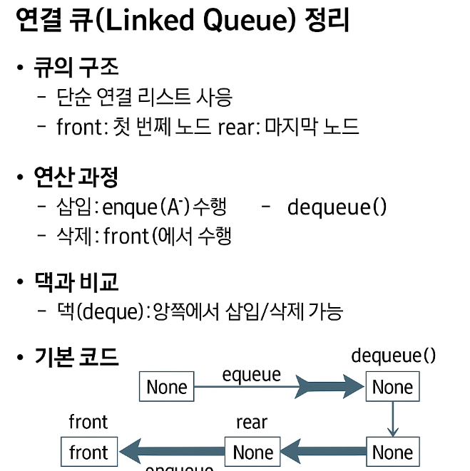

# 📌 연결 큐(Linked Queue) 정리

## 1️⃣ 연결 큐의 구조

* **자료구조**: 단순 연결 리스트(Linked List) 사용
* **큐의 원소 순서**: 노드의 연결 순서(링크)로 결정됨
* **포인터**

  * `front`: 첫 번째 노드를 가리킴
  * `rear`: 마지막 노드를 가리킴
* **상태**

  * 초기 상태: `front = rear = null`
  * 공백 상태: `front = rear = null`

---

## 2️⃣ 연산 과정

### ① 공백 큐 생성

```python
front = None
rear = None
```

### ② 삽입 (enqueue)

* 새 노드를 만들어 `rear` 뒤에 연결
* 공백 상태라면 `front = rear = newNode`

### ③ 삭제 (dequeue)

* `front`가 가리키는 노드를 삭제
* `front = front.next`
* 만약 `front == None`이면 `rear`도 `None`으로 설정

---

## 3️⃣ 동작 예시 (그림 흐름)

1. `createLinkedQueue()` → 공백 큐 생성
2. `enqueue(A)` → front=rear= A
3. `enqueue(B)` → A → B (rear가 B)
4. `dequeue()` → A 삭제 → front가 B
5. `enqueue(C)` → B → C
6. `dequeue()` → B 삭제 → front가 C
7. `dequeue()` → C 삭제 → front=rear=None

---

## 4️⃣ Deque (덱)과 비교

* **덱(deque)**: 양쪽에서 삽입/삭제 가능한 컨테이너
* 파이썬에서 `collections.deque`로 제공

```python
from collections import deque

q = deque()
q.append(1)      # 오른쪽 삽입 (enqueue)
t = q.popleft()  # 왼쪽 삭제 (dequeue)
```

---

## 5️⃣ Python 구현 예시

### 노드 정의

```python
class Node:
    def __init__(self, item, n=None):
        self.item = item
        self.next = n
```

### 삽입 (enqueue)

```python
def enqueue(item):
    global front, rear
    newNode = Node(item)
    if front is None:   # 큐가 비어있을 때
        front = newNode
    else:
        rear.next = newNode
    rear = newNode
```

### 삭제 (dequeue)

```python
def is_empty():
    return front is None

def dequeue():
    global front, rear
    if is_empty():
        print("Queue_Empty")
        return None
    
    item = front.item
    front = front.next
    if front is None:   # 큐가 비게 되면
        rear = None
    return item
```

### 조회 (peek)

```python
def qpeek():
    return front.item
```

### 출력 (print)

```python
def print_q():
    f = front
    s = ""
    while f:
        s += f.item + " "
        f = f.next
    return s
```

---

### ✅ 정리하면, **연결 큐는 단순 연결 리스트를 이용해 구현하며 삽입은 rear에서, 삭제는 front에서 이루어진다**는 것이 핵심입니다.

