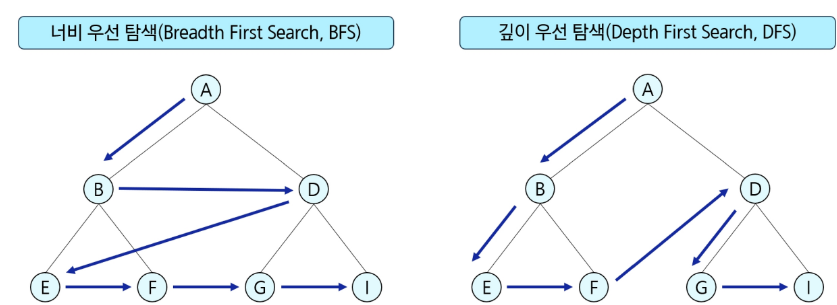
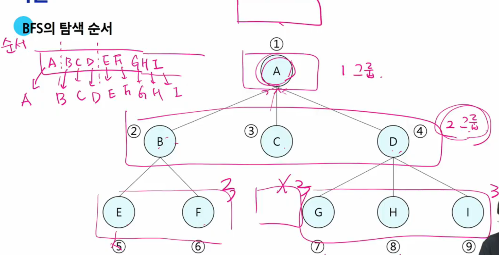

# BFS

### DFS VS BFS


## BFS란?
- 탐색 시작점의 인접한 정점들을 모두 차례로 방문한 후에 방문했던 정점을 시작점으로 하여 다시 인접한 정점들을 차례로 방문하는 방식

> [!IMPORTANT]
> 인접한 정점들에 대해 탐색을 한 후 차례로 다시 너비우선탐색을 진행해야 하므로 선입선출 형태의 자료구조인 큐를 활용

## BFS 탐색 순서


## BFS 알고리즘
- 입력 파라미터 : 그래프 G와 탐색 시작점 v
```python
def bfs(G,v):
    visited = [0]*(n+1) # n : 정점의 개수
    queue = [] # 큐 생성
    queue.append(v) # 시작점 v를 큐에 삽입

    while queue:
        t = queue.pop(0) # 큐의 첫번째 원소 소환
        if not visited[t]: # 방문되지 않은 곳이라면
            visited[t] = True # 방문한 곳으로 표시
            visit(t) # 정점 t에서 할 일
            for i in G[t]:  # t와 연결된 모든 정점에 대해
                if not visited[i]: # 방문되지 않은 곳이라면
                    queue.append(i) # 큐에 넣기
```