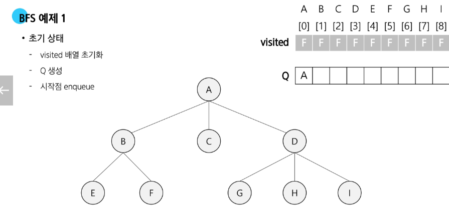
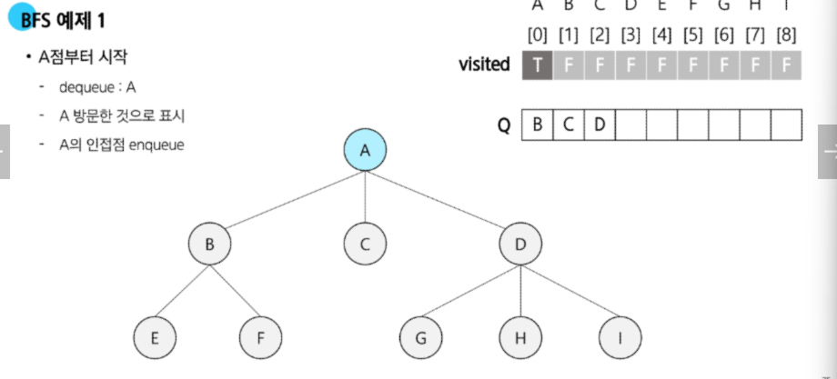
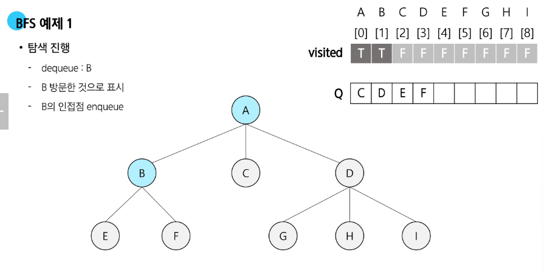
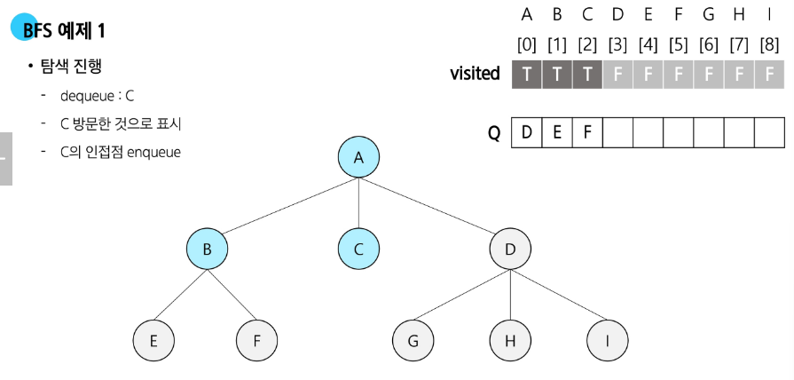
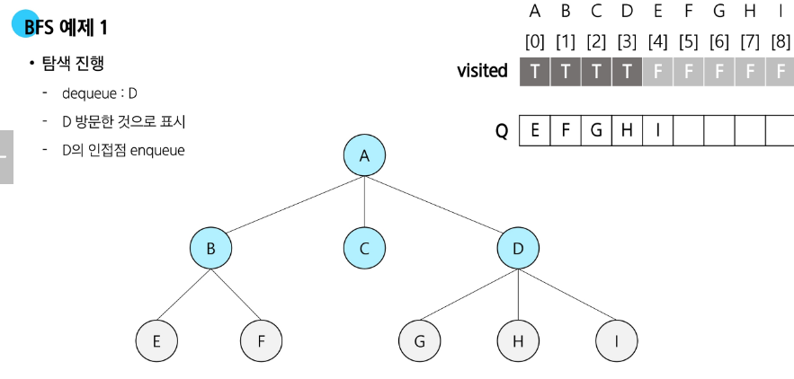
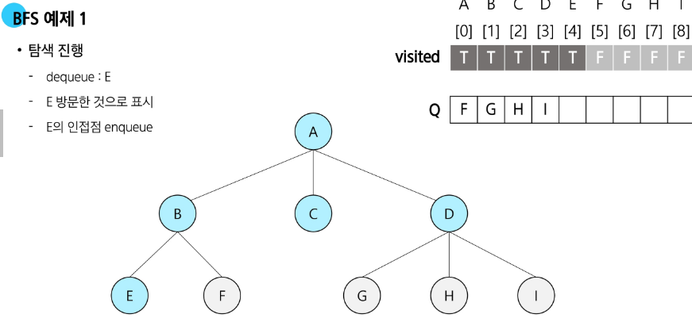
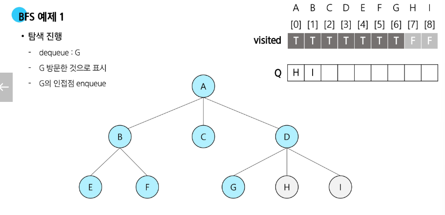
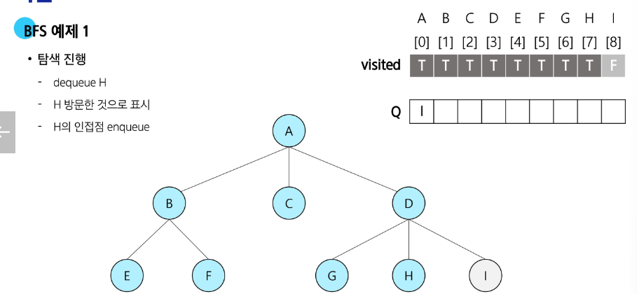
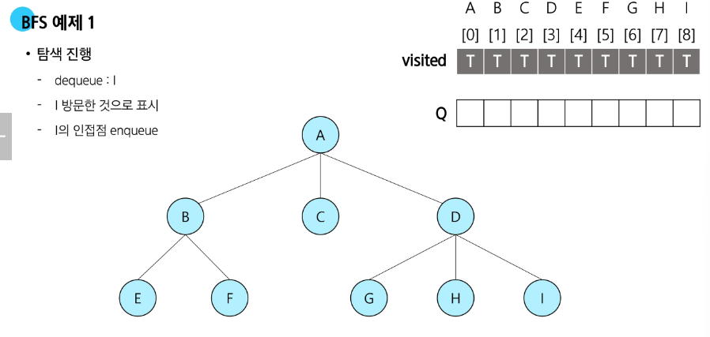

# BFS 예제 1 진행 과정

## 1. 초기 상태

* visited 배열을 F(False)로 초기화
* 큐(Q) 생성
* 시작점 A를 enqueue

---

## 2. A 점부터 시작

* dequeue: A
* A 방문 표시 (visited\[A] = True)
* A의 인접 정점 B, C, D를 enqueue

---

## 3. B 탐색

* dequeue: B
* B 방문 표시
* B의 인접 정점 E, F enqueue

---

## 4. C 탐색

* dequeue: C
* C 방문 표시
* C는 자식 노드 없음 → enqueue 변화 없음

---

## 5. D 탐색

* dequeue: D
* D 방문 표시
* D의 인접 정점 G, H, I enqueue

---

## 6. E 탐색

* dequeue: E
* E 방문 표시
* E는 자식 노드 없음

---

## 7. F 탐색

* dequeue: F
* F 방문 표시
* F는 자식 노드 없음

---

## 8. G 탐색

* dequeue: G
* G 방문 표시
* G는 자식 노드 없음

---

## 9. H 탐색

* dequeue: H
* H 방문 표시
* H는 자식 노드 없음

---

## 10. I 탐색

* dequeue: I
* I 방문 표시
* I는 자식 노드 없음

---

# 최종 BFS 탐색 순서

**A → B → C → D → E → F → G → H → I**

