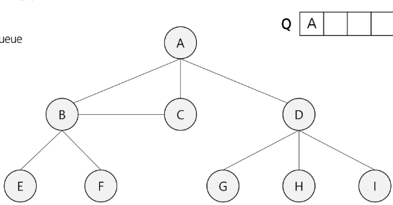

# BFS 예제 2 진행 과정



## 그래프 구조

* 시작 정점: **A**
* 인접 관계:

  * A → B, C, D
  * B → A, E, F, C
  * C → A, B
  * D → A, G, H, I
  * E → B
  * F → B
  * G → D
  * H → D
  * I → D

---

## 1. 초기 상태

* visited = \[F, F, F, F, F, F, F, F, F]
* Q = \[A]

---

## 2. A 방문

* dequeue: A
* visited\[A] = T
* A의 인접 정점 B, C, D enqueue
* Q = \[B, C, D]

---

## 3. B 방문

* dequeue: B
* visited\[B] = T
* B의 인접 정점 (A, E, F, C) 중 방문 안한 것 enqueue → E, F
* Q = \[C, D, E, F]

---

## 4. C 방문

* dequeue: C
* visited\[C] = T
* C의 인접 정점 (A, B) 모두 이미 방문
* Q = \[D, E, F]

---

## 5. D 방문

* dequeue: D
* visited\[D] = T
* D의 인접 정점 (A, G, H, I) 중 방문 안한 것 enqueue → G, H, I
* Q = \[E, F, G, H, I]

---

## 6. E 방문

* dequeue: E
* visited\[E] = T
* E의 인접 정점 (B) 이미 방문
* Q = \[F, G, H, I]

---

## 7. F 방문

* dequeue: F
* visited\[F] = T
* F의 인접 정점 (B) 이미 방문
* Q = \[G, H, I]

---

## 8. G 방문

* dequeue: G
* visited\[G] = T
* G의 인접 정점 (D) 이미 방문
* Q = \[H, I]

---

## 9. H 방문

* dequeue: H
* visited\[H] = T
* H의 인접 정점 (D) 이미 방문
* Q = \[I]

---

## 10. I 방문

* dequeue: I
* visited\[I] = T
* I의 인접 정점 (D) 이미 방문
* Q = \[]

---

> 노드 집합: A B C D E F G H I
> 간선: A–B A–C A–D  B–E B–F B–C  D–G D–H D–I  E–B  F–B  G–D  H–D  I–D

---


```python
from collections import deque

# 고정된 노드 순서(visited 출력용 인덱스 매핑)
NODES = ['A', 'B', 'C', 'D', 'E', 'F', 'G', 'H', 'I']
idx = {ch: i for i, ch in enumerate(NODES)}

# 그래프 인접 리스트 (문제의 그림과 동일한 구조, 탐색 순서가 그림과 같도록 정렬)
graph = {
    'A': ['B', 'C', 'D'],
    'B': ['A', 'E', 'F', 'C'],
    'C': ['A', 'B'],
    'D': ['A', 'G', 'H', 'I'],
    'E': ['B'],
    'F': ['B'],
    'G': ['D'],
    'H': ['D'],
    'I': ['D'],
}

def fmt_visited(visited):
    """visited 배열을 T/F로 노드 순서대로 문자열로 변환"""
    return ' '.join('T' if visited[idx[ch]] else 'F' for ch in NODES)

def fmt_queue(q):
    """deque 상태를 공백 구분 문자열로 변환"""
    return ' '.join(list(q))

def bfs_with_logs(start='A'):
    """
    슬라이드 흐름과 맞추기 위해
    - enqueue 시점: inqueue 집합에만 표시
    - dequeue 시점: visited=True 로 확정
    - 이미 큐에 있으면 중복 enqueue 방지
    """
    q = deque()
    visited = [False] * len(NODES)
    inqueue = set()  # 큐 중복 방지용

    step = 0

    # 초기화
    q.append(start)
    inqueue.add(start)
    print(f"[Step {step}] 초기화")
    print(f"visited: {fmt_visited(visited)}")
    print(f"Q: {fmt_queue(q)}\n")

    # BFS 진행
    while q:
        step += 1
        cur = q.popleft()
        # 방문 확정
        visited[idx[cur]] = True

        print(f"[Step {step}] dequeue: {cur}  → 방문 처리")
        print(f"visited: {fmt_visited(visited)}")

        # 이웃들 enqueue
        enq_list = []
        for nxt in graph.get(cur, []):
            if (not visited[idx[nxt]]) and (nxt not in inqueue):
                q.append(nxt)
                inqueue.add(nxt)
                enq_list.append(nxt)

        enq_str = ' '.join(enq_list) if enq_list else "(없음)"
        print(f"enqueue: {enq_str}")
        print(f"Q: {fmt_queue(q)}\n")

    # 방문 순서 반환(확인용)
    order = []
    # 위 루프에서 확정 방문 순서를 별도로 기록하지 않았으므로,
    # 동일 순서를 구하려면 한 번 더 실행해 순서만 수집
    q.clear()
    visited = [False] * len(NODES)
    inqueue.clear()
    q.append(start)
    inqueue.add(start)
    while q:
        cur = q.popleft()
        visited[idx[cur]] = True
        order.append(cur)
        for nxt in graph.get(cur, []):
            if (not visited[idx[nxt]]) and (nxt not in inqueue):
                q.append(nxt)
                inqueue.add(nxt)
    return order

if __name__ == "__main__":
    order = bfs_with_logs(start='A')
    print("[최종 방문 순서]")
    print(' → '.join(order))
```

---

## 단계별 흐름 요약(코드 출력과 동일)

* **Step 0 초기화**
  visited: F F F F F F F F F
  Q: A

* **Step 1 dequeue A** 방문 처리
  visited: T F F F F F F F F
  enqueue: B C D
  Q: B C D

* **Step 2 dequeue B** 방문 처리
  visited: T T F F F F F F F
  enqueue: E F
  Q: C D E F

* **Step 3 dequeue C** 방문 처리
  visited: T T T F F F F F F
  enqueue: (없음)
  Q: D E F

* **Step 4 dequeue D** 방문 처리
  visited: T T T T F F F F F
  enqueue: G H I
  Q: E F G H I

* **Step 5 dequeue E** 방문 처리
  visited: T T T T T F F F F
  enqueue: (없음)
  Q: F G H I

* **Step 6 dequeue F** 방문 처리
  visited: T T T T T T F F F
  enqueue: (없음)
  Q: G H I

* **Step 7 dequeue G** 방문 처리
  visited: T T T T T T T F F
  enqueue: (없음)
  Q: H I

* **Step 8 dequeue H** 방문 처리
  visited: T T T T T T T T F
  enqueue: (없음)
  Q: I

* **Step 9 dequeue I** 방문 처리
  visited: T T T T T T T T T
  enqueue: (없음)
  Q:

**최종 방문 순서**
A → B → C → D → E → F → G → H → I

---

### 구현 포인트 정리

* 슬라이드와 동일한 흐름을 위해 **큐에 넣을 때는 inqueue만 표시**하고 **visited는 dequeue 시점에 True**로 설정하였습니다
* **중복 enqueue 방지를 위해 inqueue 집합**을 사용하였습니다
* 출력 형식을 통일해 **visited와 Q의 상태를 매 단계마다 확인**할 수 있도록 구성하였습니다


# 최종 BFS 탐색 순서

**A → B → C → D → E → F → G → H → I**

