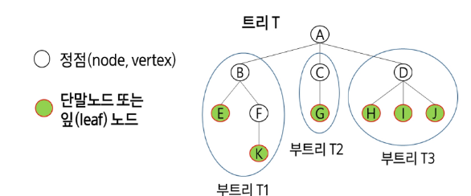
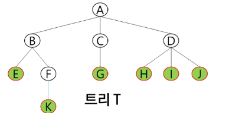

# Tree
- 비선형구조로 원소들 간에 1:n 관계를 가지는 자료구조
- 원소들 간에 계층관계를 가지는 계층형 자료구조
- 상위 원소에서 하ㅜ이 원소로 내려가면서 확장되는 구조

## 트리의 정의
- 한 개 이상의 노드로 이루어진 유한 집합이며 다음조건 만족함
    - 노드 중 최상위 노드를 **`root`**라고함
    - 나머지 노드들은 n(>=)개의 분리집합 T1...TN으로 분리될 수 있다
    
- ** 이들은 각각 하나의 트리가 되며(재귀적 정의) 루트의 부트리(subtree)라고함**

  
### 용어
- 노드 : 트리의 원소
    - 트리T의 노드 : A,B,C,D,E,F,G,H,I,J,K
    
- 간선(edge) : 노드를 연결하는 선 부모노드와 자식노드를 연결
- 루트 노드 : 트리의 시작노드
    - 트리T의 루트노드 : A
  
- 형제 노드(sibling node) : 같은 부모 노드의 자식 노드들
    - B,C,D 는 형제노드
    
- 조상 노드 : 간선을 따라 루트 노드까지 이르는 경로에 있는 모든 노드들
    - K의 조상 노드 : F,B,A
    
- 서브 트리 : 부모 노드와 연결된 간선을 끊었을때 생성되는 트리
- 자손 노드 : 서브 트리에 있는 하위 레벨의 노드들
    - B의 자손 노드 : E,F,K
    
- 노드의 차수 : 노드에 연결된 자식 노드의 수
    - B의 차수 = 2 , C의 차수 = 1
    
- 트리의 차수 : 트리에 있는 노드의 차수 중에서 가장 큰 값
    - 트리 T의 차수 = 3
    
- 단말 노드(리프 노드) : 차수가 0인 노드 , 자식 노드가 없는 노드

- 노드의 높이 : 루트에서 노드에 이르는 간선의 수, 노드의 레벨
    - B의 높이 = 1, F의 높이  = 2
    
- 트리의 높이 : 트리에 있는 노드의 높이 중에서 가장 큰 값
    - 트리T의 높이
    
> [!NOTE]
> 단, 노드의 레벨이 1로 시작하는 경우가 있으나 이는 잘못된것이 아님 보통 0 or 1로 많이 설정함

