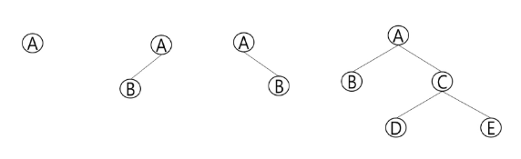
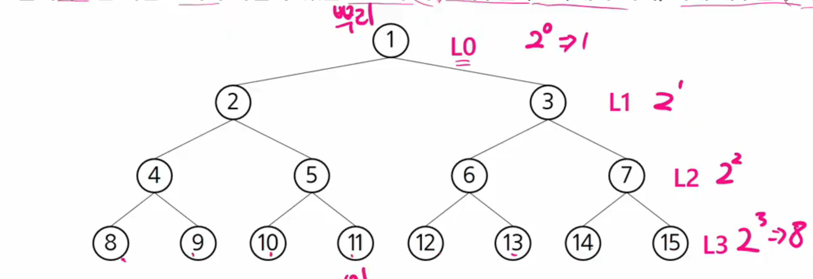
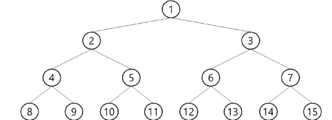
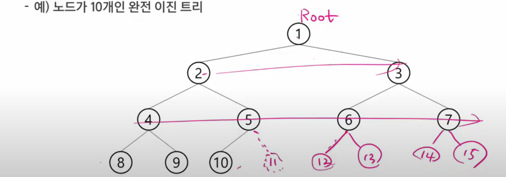
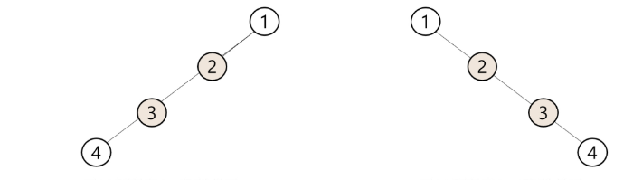

# 이진 트리
- 모든 노드들이 2개의 서브트리를 갖는 특별한 형태의 트리
- 각 노드가 자식 노드를 최대 **2개**까지만 가질 수 있는 트리
    - 왼쪽 자식 노드
    - 오른쪽 자식 노드
    
- 예시

  
### 이진 트리의 특성

- 레벨 i에서의 노드의 최대 개수는 **2^i 개**
- 높이가 h인 이진 트리가 가질 수 있는 노드의 최소 개수는 **(h+1) 개**  
  최대 개수는 **(2^(h+1) - 1) 개**

### 포화 이진 트리 (Full Binary Tree)
- 모든 레벨에 노드가 포화상태로 차 있는 이진 트리
- 높이가 h일때 최대의 노드의 개수인 **(2^(h+1) - 1) 개**의 노드를 가진 이진 트리
    - 높이가 3 일때 2^(3+1) - 1 = 15개의 노드를 갖는다
    
- 루트를 1번으로 항 **(2^(h+1) - 1) 개**까지 정해진 위치에 대한 노드 번호를 매김

  
### 완전 이진 트리 (Complete Binary Tree)

- 높이가 h이고 노드 수가 n개일 때  
  (단, 2h ≤ n ≤ 2h+1-1),  
  포화 이진 트리의 노드 번호 1번부터 n번까지 빈 자리가 없는 이진 트리
    
- 예) 노드가 10개인 완전 이진 트리

### 편향 이진 트리 (Skewed Binary Tree)
- 높이가h에 대한 최소 개수의 노드를 가지면서 한쪽 방향의 자식노드만을 가진 이진 트리

  

