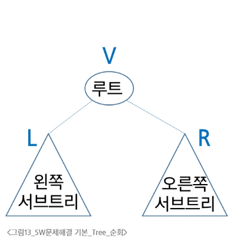
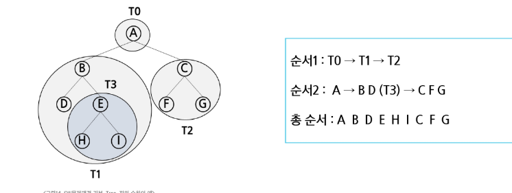
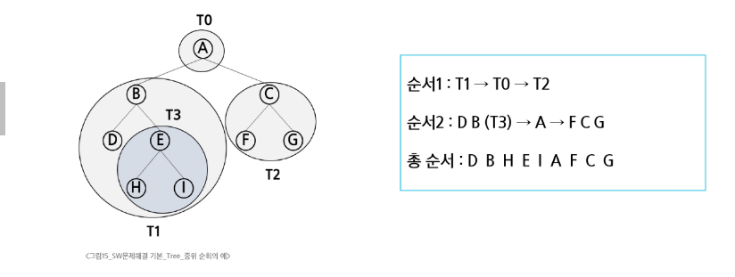
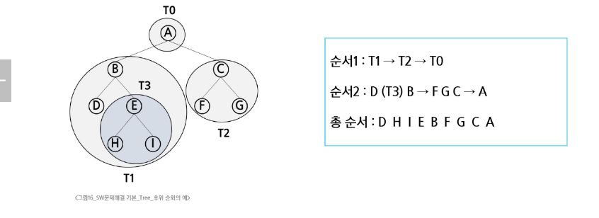

# 🌳 이진 트리 순회 (Binary Tree Traversal)

- 트리의 각 노드를 중복되지 않게 전부 방문하는것

> [!CAUTION]
> 트리는 비 선형 구조이기 떄문에 선형구조에서와 같이 선후 연결 관계 알 수 없음

- 트리의 노드들을 체계적으로 방문하는 것이기도 함

## 3가지의 기본적인 순회방법



- 전위순회 (preorder) : V -> L -> R
    - 부모 노드 방문 후 자식 노드를 좌,우 순서로 방문

- 중위순회 (inorder) : L -> V -> R
    - 왼쪽 자식 ,부모 ,오른쪽 자식 순서 방문

- 후위순회 (postorder) : L -> R -> V
    - 자식 좌,우 순서 방문 후 부모노드 방문

## 1. 전위 순회 (Preorder Traversal)

* **수행 방법**

    1. 현재 노드 `n`을 방문하여 처리한다. → **V**
    2. 현재 노드 `n`의 **왼쪽 서브트리**로 이동한다. → **L**
    3. 현재 노드 `n`의 **오른쪽 서브트리**로 이동한다. → **R**

* **전위 순회 알고리즘**

```python
def preorder_traverse(T):
    # T가 None이 아니면 실행
    if T:
        visit(T)  # ① 현재 노드를 방문 (출력 또는 처리)
        preorder_traverse(T.left)  # ② 왼쪽 서브트리로 이동
        preorder_traverse(T.right)  # ③ 오른쪽 서브트리로 이동
```

### 전위 순회의 예



---

## 2. 중위 순회 (Inorder Traversal)

* **수행 방법**

    1. 현재 노드 `n`의 **왼쪽 서브트리**로 이동한다. → **L**
    2. 현재 노드 `n`을 방문하여 처리한다. → **V**
    3. 현재 노드 `n`의 **오른쪽 서브트리**로 이동한다. → **R**

* **중위 순회 알고리즘**

```python
def inorder_traverse(T):
    # T가 None이 아니면 실행
    if T:
        inorder_traverse(T.left)  # ① 왼쪽 서브트리로 이동
        visit(T)  # ② 현재 노드 방문
        inorder_traverse(T.right)  # ③ 오른쪽 서브트리로 이동
```

### 중위 순회의 예



---

## 3. 후위 순회 (Postorder Traversal)

* **수행 방법**

    1. 현재 노드 `n`의 **왼쪽 서브트리**로 이동한다. → **L**
    2. 현재 노드 `n`의 **오른쪽 서브트리**로 이동한다. → **R**
    3. 현재 노드 `n`을 방문하여 처리한다. → **V**

* **후위 순회 알고리즘**

```python
def postorder_traverse(T):
    # T가 None이 아니면 실행
    if T:
        postorder_traverse(T.left)  # ① 왼쪽 서브트리로 이동
        postorder_traverse(T.right)  # ② 오른쪽 서브트리로 이동
        visit(T)  # ③ 현재 노드 방문
```

### 후위 순회의 예


