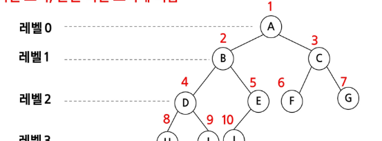
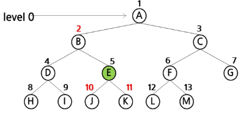
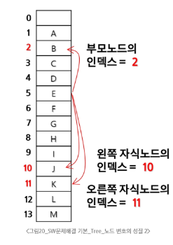
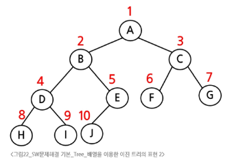
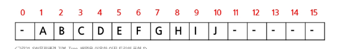
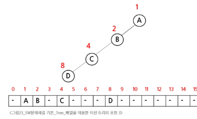
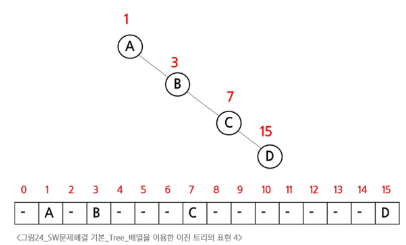

# 4.이진트리표현 1

- 이진 트리에 각 노드 번호를 다음과 같이 부여
- 루트의 번호를 1부터로함
- 레벨 n에 있는 노드에 대하여 왼쪽부터 오른쪽으로 2^n 부터 **(2^(h+1) - 1) 개**까지 번호를 차례로 부여
#### 포화 이진 트리 완전 이진 트리에 적합

### 노드 번호의 성질
- 노드 번호가 i인 노드의 부모 노드 번호 : i/2
- 노드 번호가 i인 노드의 왼쪽 자식 노드 번호 : 2 * i  
- 노드 번호가 i인 노드의 오른쪽 자식 노드 번호 : 2 * i + 1
- 레벨 n의 노드 번호 시작 번호 : 2^n

### 📌 배열을 이용한 이진 트리의 표현

- 노드 번호를 배열의 인덱스로 사용

-  높이가 h인 이진 트리를 위한 배열의 크기는?
    - 레벨 i의 최대 노드 수는? → 2^i  
    - 따라서 `1 + 2 + 4 + 8 + ... + 2^h`  
    - 즉, ∑ 2^i = 2^(h+1) - 1
    

      

### 배열을 이용한 이진 트리의 표현

