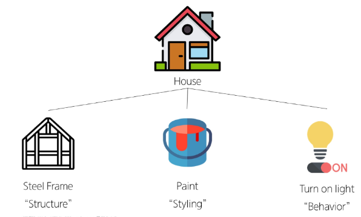
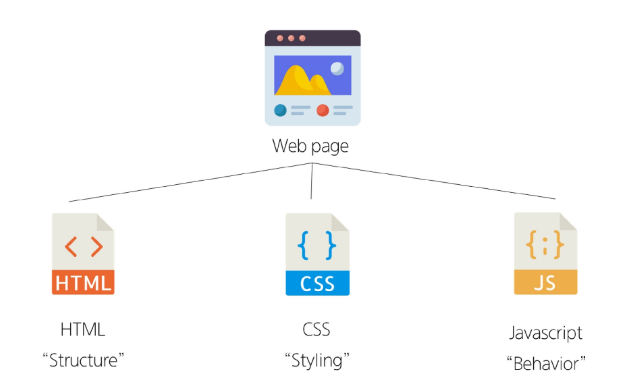

# 웹

## www
- World Wide Web : 인터넷으로 연결된 컴퓨터드링 정보를 공유하는 거대한 정보 공간

## Web

- Web site,Web Application 등을 통해 사용자들이 정보를 검색하고 상호작용하는 기술

## Web site
- 인터넷에서 여러 개의 Web page가 모인것
- 사용자들에게 정보나 서비스를 제공하는 공간

## Web page
- HTML,CSS 등의 웹 기술을 이용하여 만들어진 'Web site'를 구성하는 하나의 요소

### Web page 구성 요소

