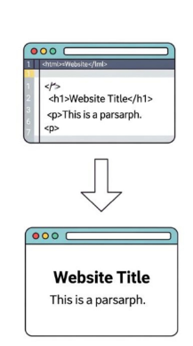
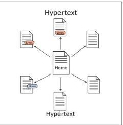
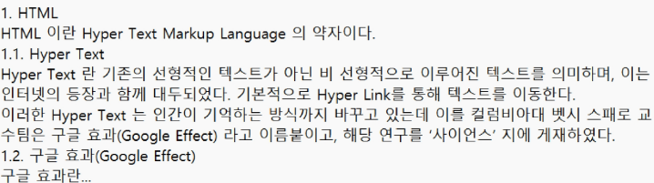
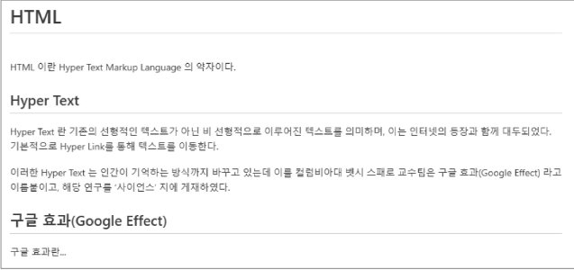

# HTML

- 웹페이지의 의미와 구조를 정의하는 언어




## HyperText
- 웹 페이지를 다른 페이지로 연결하는 링크

> [!TIP]
> - 참고를 통해 사용자가 한 문서에서 다른 문서로 즉시 접근할 수 있는 텍스트
> - 비선형성/상호연결성/사용자 주도적 탐색


## Markup Language
- 태그 등을 이용하여 문서나 데이터의 구조를 명시하는 언어
> [!TIP]
> - 인간이 읽고 쓰기 쉬운 형태이며, 데이터의 구조와 의미를 정의하는 데 집중
> - ex) HTML, MarkDown

### 예시 1
- 아무런 구조와 형식 없이 내용만 있는 원본 데이터


### 예시 2

- 사람이 이해할 수 있도록 논리적 구조를 부여한 상태



### 예시 3

- 컴퓨터가 이해하고 화면에 표현할 수 있도록 약속된 언어(HTML)로 구조를 완성한 상태  

```html
<h1>HTML</h1>
<p> HTML 이란 Hyper Text Markup Language 의 약자이다. </p>
<h2>Hyper Text</h2>
<p> Hyper Text 란 기존의 선형적인 텍스트가 아닌 비 선형적으로 이루어진 텍스트를 의미하며, 이는 인터넷의 등장과 함께 대두되었다. 
기본적으로는 Hyper Link를 통해 텍스트를 이동한다. </p>
<p> 이러한 Hyper Text 는 인간이 기억하는 방식까지 바꾸고 있는데 이를 컬럼비아대 벳시 스패로 교수팀은 구글 효과(Google Effect)라고 이름붙이고, 
해당 연구를 ‘사이언스’ 지에 게재하였다. </p>
<h2>구글 효과(Google Effect)</h2>
<p> 구글 효과란... </p>
```

### 예시 4

- 웹 브라우저가 HTML 코드를 해석하여 사용자에게 보여주는 실제 웹 페이지 화면




