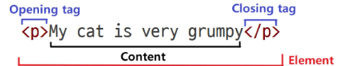
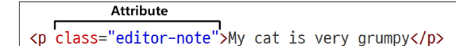

# HTML 구조란?

HTML(하이퍼텍스트 마크업 언어)은 웹 페이지의 구조를 정의하는 언어입니다. HTML 문서는 여러 요소로 구성되며, 각 요소는 태그(`<tag>`)로 감싸서 작성합니다.

## 기본 HTML 문서 구조

```html
<!DOCTYPE html>
<html lang="ko">
  <head>
    <meta charset="UTF-8">
    <title>문서 제목</title>
  </head>
  <body>
    <header>
      <!-- 헤더 내용 -->
    </header>
    <nav>
      <!-- 내비게이션 메뉴 -->
    </nav>
    <main>
      <!-- 주요 콘텐츠 -->
    </main>
    <footer>
      <!-- 푸터 내용 -->
    </footer>
  </body>
</html>
```

## 주요 태그 설명

- `<!DOCTYPE html>`: HTML5 문서임을 선언
- `<html>`: 전체 HTML 문서의 루트(root) 요소
- `<head>`: 문서의 메타 정보(문자셋, 제목 등) 포함
- `<body>`: 실제 화면에 표시되는 콘텐츠 영역
- `<header>`, `<nav>`, `<main>`, `<footer>`: 시맨틱 태그로 각각 헤더, 내비게이션, 주요 내용, 푸터를 의미

### HTML element
- 하나의 요소는 여는 태그와 닫는 태그 그리고 그 안의 내용으로 구성
- 닫는 태그는 태그 이름 앞에 슬래시가 포함
  - 닫는 태그가 없는 태그도 존재



### HTML Attributes
- 사용자가 원하는 기준에 맞도록 요소를 설정하거나 다양한 방식으로 요소의 동작을 조절하기 위한 값
- 목적
  - 나타내고 싶지 않지만 추가적인 기능, 내용을 담고 싶을 때 사용
  - CSS 에서 스타일 적용을 위해 해당 요소를 선택하기 위한 값으로 활용됨

- 작성규칙
1. 속성은 요소 이름과 속성 사이에 공백이 있어야 함
2. 하나 이상의 속성들이 있는 경우엔 속성 사이에 공백으로 구분함
3. 속성 값은 열고 닫는 따옴표로 감싸야 함



### HTML 구조 예시

```html
<!DOCTYPE html>
<html lang="en">
<head>
    <meta charset="UTF-8">
    <title>My page</title>
</head>
<body>
    <p>My page</p>
    <a href="https://www.google.co.kr/">Google</a>
    
    
</body>
</html>
```

---

### 주요 태그 설명

* `<p></p>`
  Paragraph(문단)의 약자로, 텍스트 문단을 만드는 태그

* `<a></a>`
  Anchor(닻)의 약자로, 다른 페이지로 이동시키는 하이퍼링크 태그

* ``
  Image(이미지)의 약자로, `src`에 지정된 그림을 보여주는 태그

#### 크롬 개발자 모드에서도 확인 가능