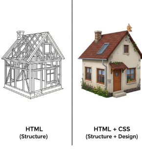
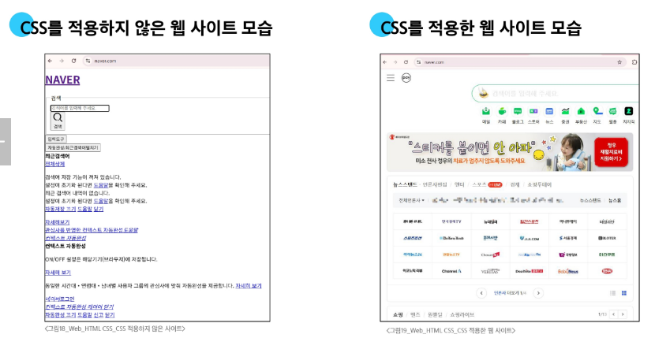

# 🌐 CSS 스타일 적용 방식

- 웹 페이지의 디자인과 레이아웃을 구성하는 언어



### CSS 적용 VS 미적용


## CSS 스타일 적용 방식

### 1. 인라인(Inline) 스타일

* HTML 요소 안에 **style 속성 값**으로 작성
* 특정 요소 하나에만 CSS 스타일을 직접 적용

```html
<!DOCTYPE html>
<html lang="en">
<head>
  ...
</head>
<body>
  <h1 style="color: blue; background-color: yellow;">Hello World!</h1>
</body>
</html>
```

📌 **설명**

* **HTML**: 웹 페이지의 의미와 구조를 정의하는 언어
* **style 속성 값**: 특정 요소에 직접 스타일을 적용하는 속성

---

### 2. 내부(Internal) 스타일 시트

* `<head>` 태그 안에 `<style>` 태그에 작성
* 문서 전체에서 CSS 코드 적용 가능

```html
<!DOCTYPE html>
<html lang="en">
<head>
  <title>Document</title>
  <style>
    h1 {
      color: blue;
      background-color: yellow;
    }
  </style>
</head>
<body>
  <h1>Hello World!</h1>
</body>
</html>
```

📌 **설명**

* `<head>` 태그: 제목, CSS 등 보이지 않는 설정 정보를 담음
* `<style>` 태그: 문서 전체에 적용할 CSS 코드를 작성

---

### 3. 외부(External) 스타일 시트

* 별도 CSS 파일 생성 후 `<link>` 태그로 불러오기
* 가장 많이 사용되는 방식 (재사용성 및 유지보수 용이)

```html
<!-- structure.html -->
<!DOCTYPE html>
<html lang="en">
<head>
  <link rel="stylesheet" href="style.css">
  <title>Document</title>
</head>
<body>
  <h1>Hello World!</h1>
</body>
</html>
```

```css
/* style.css */
h1 {
  color: blue;
  background-color: yellow;
}
```

📌 **설명**

* `<link>` 태그: 외부 CSS 파일을 연결
* 유지보수와 확장성에 유리

---

> [!TIP]
> * 스타일 적용 우선순위는 **인라인 > 내부 > 외부** 순으로 적용됨
> * 인라인 스타일은 유지보수와 재사용성이 어렵기 때문에 **특수한 경우**를 제외하면 권장되지 않음
> * 실무에서는 보통 **외부 CSS 파일**을 연결해 사용


