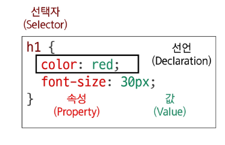
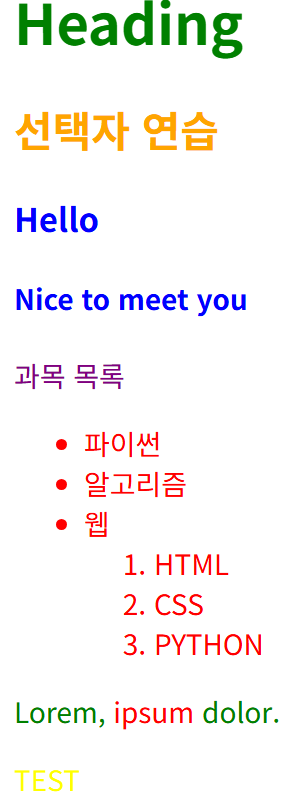
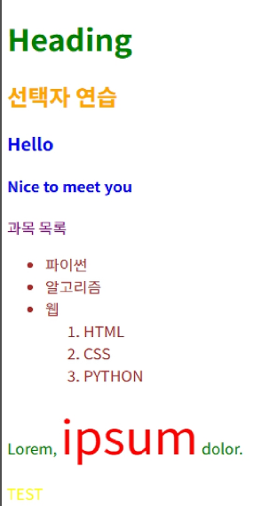

# css구문



### 선택자

- 누구를 꾸밀지 지정하는 부분

### 선언

- 어떻게 꾸밀지에 대한 구체적인 한 줄의 명령
- 속성과 값이 한 쌍으로 이루어지며 세미콜론으로 끝남

### 속성

- 바꾸고 싶은 스타일의 종류를 나타냄

### 값

- 속성에 적용할 구체적인 설정을 나타냄

# CSS 선택자

- HTML 요소를 선택하여 스타일을 적용할 수 있도록 하는 선택자

```css
/* h1이 선택자인거임 */
h1 {
  color: red;
  font-size: 50px;
}
```

### CSS 선택자 : 기본 선택자 1

- 전체 선택자 - `*`
  - HTML 모든 요소를 선택

- 요소 선택자
  - 지정한 모든 태그를 선택

```css
/* 전체 선택자 */
* {
  color : red;
}

/* 요소 선택자 */
h2 {
  color: green;
}

h3,
h4 {
  color : blue;
}
```

```html
<body>
  <h1 class="green">Heading</h1>
  <h2>선택자 연습</h2>
  <h3>Hello</h3>
  <h4>Nice to meet you</h4>
  <p id="purple">과목 목록</p>
  <ul class="green">
    <li>파이썬</li>
    <li>알고리즘</li>
    <li>웹
      <ol>
        <li>HTML</li>
        <li>CSS</li>
        <li>PYTHON</li>
      </ol>
    </li>
  </ul>
  <p class="green">
    Lorem, <span>ipsum</span> dolor.
  </p>
  <p class="yellow">TEST</p>
</body>

```

### CSS 선택자 : 기본 선택자 2
- 클래스 선택자 - `.`
  - 주어진 클래스 속성을 가진 모든 요소를 선택

- 아이디 선택자 - `#`
  - 주어진 아이디 속성을 가진 요소 선택
  - 문서에는 주어진 아이디를 가진 요소가 하나만 있어야 함
  
- 속성 선택자 - `[]`
  - 주어진 속성이나 속성값을 가진 모든 요소 선택
  - 속성의 존재 여부 값의 일치/포함 등 다양한 조건으로 요소를 정교하게 선택 가능
  

```css
/* 클래스 선택자 */
.green {
  color : green;
}

/* 요소 선택자 */
#purple {
  color: purple;
}

[class^="y"] {
  color : yellow;
}
```

```html
<body>
  <h1 class="green">Heading</h1>
  <h2>선택자 연습</h2>
  <h3>Hello</h3>
  <h4>Nice to meet you</h4>
  <p id="purple">과목 목록</p>
  <ul class="green">
    <li>파이썬</li>
    <li>알고리즘</li>
    <li>웹
      <ol>
        <li>HTML</li>
        <li>CSS</li>
        <li>PYTHON</li>
      </ol>
    </li>
  </ul>
  <p class="green">
    Lorem, <span>ipsum</span> dolor.
  </p>
  <p class="yellow">TEST</p>
</body>

```
### 실행결과



## CSS 결합자 (Combinators) (1/2)
```html
<body>
  <h1 class="green">Heading</h1>
  <h2>선택자 연습</h2>
  <h3>Hello</h3>
  <h4>Nice to meet you</h4>
  <p id="purple">과목 목록</p>
  <ul class="green">
    <li>파이썬</li>
    <li>알고리즘</li>
    <li>웹
      <ol>
        <li>HTML</li>
        <li>CSS</li>
        <li>PYTHON</li>
      </ol>
    </li>
  </ul>
  <p class="green">
    Lorem, <span>ipsum</span> dolor.
  </p>
  <p class="yellow">TEST</p>
</body>

```

### ✅ 자손 결합자 (`" "` 공백)

* 첫 번째 요소의 **자손 요소들** 선택
* 예) `p span` 은 `<p>` 안에 있는 모든 `<span>`을 선택 (하위 레벨 상관 없음)

```css
/* 자손 결합자 */
.green > span {
  font-size: 50px;
}
```

---

### ✅ 자식 결합자 (`">"`)

* 첫 번째 요소의 **직계 자식만 선택**
* 예) `ul > li` 는 `<ul>` 안에 있는 모든 `<li>`를 선택 (한 단계 아래 자식들만)

```css
/* 자식 결합자 */
.green li {
  color: brown;
}
```

---

📌 **정리**

* `" "` (공백): 모든 하위 자손 선택
* `">"` : 바로 아래 자식만 선택

### 실행결과
