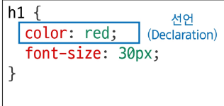
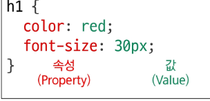

# CSS 선언
- 선택된 요소에 적용할 스타일을 구체적으로 명시하는 부분
### CSS 선언의 목적
- 선택자는 어떤 요소에 스타일을 적용할지 결정하는 규칙
- 선택자로 요소를 선택했으니 이제 중괄호 안에 무엇을 할지 정의
- 이 무엇을에 해당하는 부분이 바로 선언

### 속성 
- 스타일링하고 싶은 기능이나 특성을 의미
- CSS가 미리 정의해 둔 키워드 사용
- font-size, width 등

### 값
- 속성에 적용될 구체적인 설정
- 속성이 받을 수 있는 값의 종류는 정해져있음
- 16px,10rem 등

### 값의 단위
- color : red; 처람 키워드로 끝나는 값도 있지만 크기나 간격을  나타낼 때는 단위가 필수적
- 단위는 크게 절대단위와 상대단위로 나뉨

| 구분      | 단위 종류             | 특징                                                             |
| --------- | --------------------- | ---------------------------------------------------------------- |
| 절대 단위 | px, pt, cm 등         | 다른 요소의 영향을 받지 않는 고정된 크기                         |
| 상대 단위 | %, em, rem, vw, vh 등 | 다른 요소(부모, 화면 표시 영역 등)의 크기에 따라 상대적으로 결정 |

> [!TIP]
> - 웹 디자인에서는 반응형 웹과 접근성 때문에 **상대 단위의 중요성**이 매우 높습니다.  
> - 값이 0일 때는 단위를 생략하는 것이 권장됩니다.
