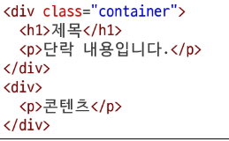
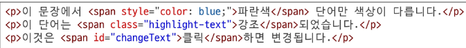
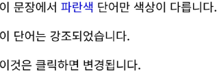

# display 속성

### 박스타입
- 박스타입에 따라 페이지에서의 배치 흐름 및 다른 박스와 관련하여 박스가 동작하는 방식이 달라짐

## block 타입
- 블록 타입은 하나의 독립된 덩어리처럼 동작하는 요소
```css
.index {
  display: block;
}
```
- 항상 새로운 행으로 나뉨(한 줄 전체를 차지, 너비 100%)
- width,height,margin,padding 속성 모두 사용 가능
-  margin,padding,border로 인해 다른 요소를 상자로부터 밀어냄
-  width 속성을 지정하지 않으면 박스는 inline 방향으로 사용 가능한 공간을 모두 차지함
   -  상위 컨테이너 너비 100%로 채우는것
- 대표적인 block 타입 태그
  - h1~6, p, div, ul, li
  
### block 타입의 대표 : `div`
- 다른 HTML 요소들을 그룹화하여 레이아웃을 구성하거나 스타일링을 적용가능
- 헤더,푸터,사이드바 등 웹페이지의 다양한 섹션을 구조화하는데 가장 많이쓰임




## inline 타입
- 문장 안의 단어처럼 흐름에 따라 자연스럽게 배치되는 요소

```css
.index {
  display : inline;
}
```

### inline 타입의 대표 : `span`

- 자체적으로 시각적 변화 없음
  - 스타일을 적용하기 전까진 특별한 변화 없음
- 택스트 일부조작
  - 문장 내 특정 단어나 구문에만 스타일을 적용할때 유용
- 블록 요소처럼 줄바꿈을 일의킺 않으므로 문서의 구조에 큰 변화를 주지 않음





