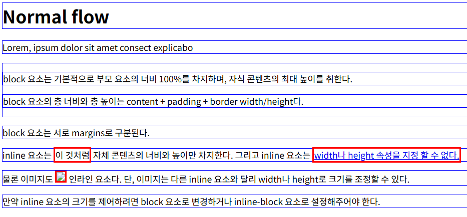
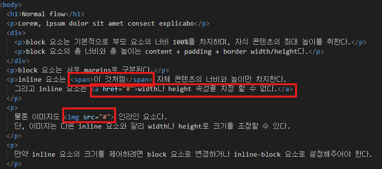

# Normal Flow
- 일반적인 흐름 또는 레이아웃을 변경하지 않은 경우 웹페이지 요소가 배치되는 방식

> [!NOTE]
> 워드 문서를 예로 들면 엔터를 눌러 문단을 나누는것이 block 요소의 배치 방식
> 엔터를 누르지 않고 계속 타이핑하는 것이 inline 요소의 배치방식

### 예시
- 블록을 한 줄 전체를 인라인은 컨텐츠만큼의 공간만 차지하며 줄을 바꾸지 않음
  




```css
a,
span,
img {
  border: 3px solid red;
}

h1,
p,
div {
  border: 1px solid blue;
}
```

