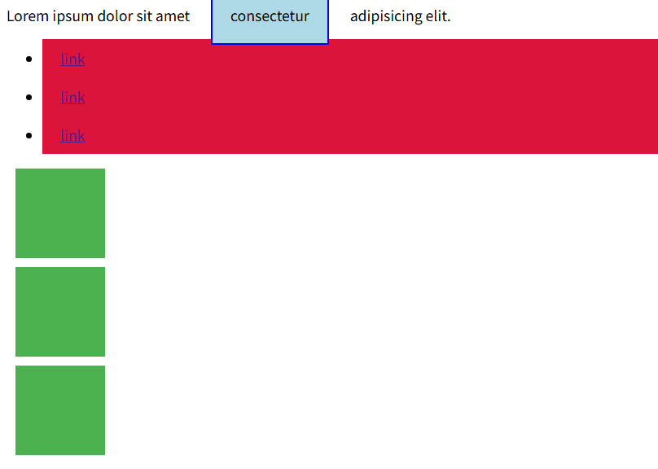
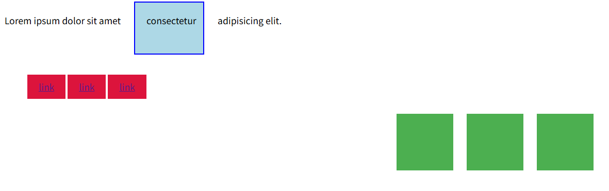
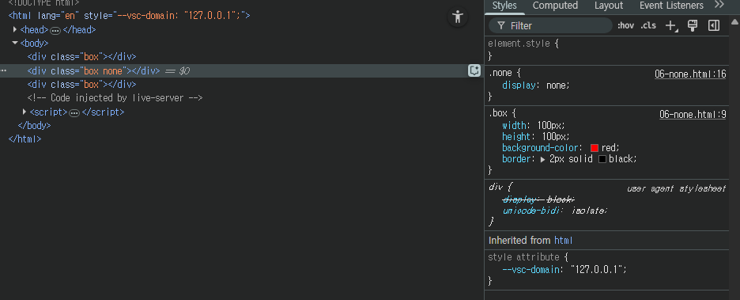

# 기타 display 속성+

## inline-block 타입
- inline과 block 의 특징을 모두 가진 특별한 display 속성 값

```css
.index {
  display: inline-block;
}
```

- Block과 inline의 특징을 합친것(줄바꿈 없이,크기 지정 가능)
- width 및 height 속성 사용 가능
- padding,margin 및 border로 인해 다른 요소가 상자에서 밀려남
  
> [!TIP]
> 주로 가로로 정렬된 네비게이션 메뉴나 여러 개의 버튼, 이미지 갤러리처럼 수평으로 나열하면서 각 항목의 크기를 직접 제어하고 싶을때 매우 유용하게 사용

### 예시

- Before


- After


```html
<!-- 1. 이제 다른 요소를 밀어낼 수 있는 span -->
  <p>Lorem ipsum dolor sit amet <span>consectetur</span> adipisicing elit.</p>

  <!-- 2. 리스트 요소를 가로로 정렬 -->
  <ul>
    <li><a href="#">link</a></li>
    <li><a href="#">link</a></li>
    <li><a href="#">link</a></li>
  </ul>

  <!-- 3. div 요소를 가로로 정렬 -->
  <div class="container">
    <div class="box"></div>
    <div class="box"></div>
    <div class="box"></div>
  </div>
```

```css
span {
      margin: 20px;
      padding: 20px;
      width: 80px;
      height: 50px;
      background-color: lightblue;
      border: 2px solid blue;
      display: inline-block;
    }

    ul>li {
      background-color: crimson;
      padding: 10px 20px;
      display: inline-block;
    }

    .container {
      text-align: center;
    }

    .box {
      width: 100px;
      height: 100px;
      background-color: #4CAF50;
      margin: 10px;
      display: inline-block;
    }
```

### none 타입
- 요소를 화면에 표시하지 않고 공간조차 부여되지 않음
```css
.index {
  display: none;
}
```

### 예시


```css
.box {
  width: 100px;
  height: 100px;
  background-color: red;
  border: 2px solid black;
}

.none {
  display: none;
}
```

