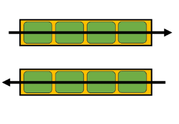
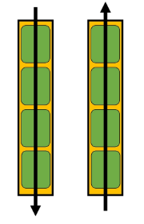
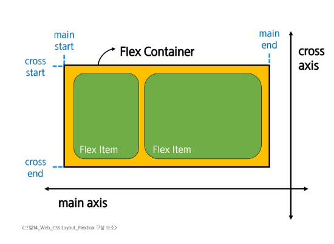
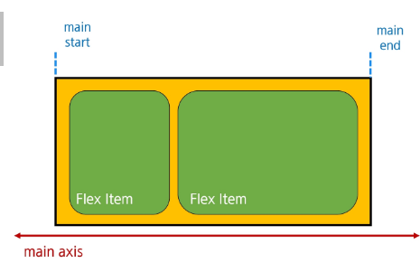
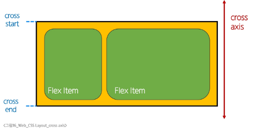
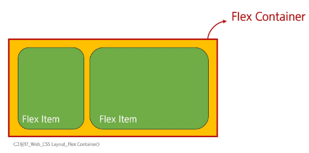
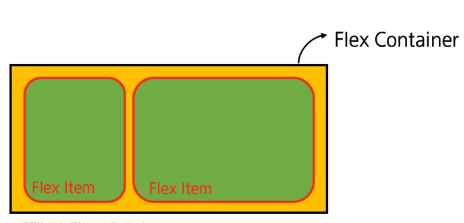

# Flexbox 구성요소
- 요소를 행과열 형태로 배치하는 1차원 레이아웃 방식

```css
.container {
  display: flex;
}
```

### css flexbox
- 요소를 행과 열 형태로 배치하는 1차원 레이아웃 방식
  - 공간 배열 & 정렬






## 주요 구성 요소
- main axis
- cross axis
- flex container
- flex item
> [!CAUTION]
> flexbox엔 가로 새로가 없음 왜냐면 보는 방향에 따라 동적으로 달라지기 때문



### main axis (주 축)
- flex item들이 배치되는 기본 축
- main start 에서 시작하여 main end 방향으로 배치(default 값)



### cross axis(교차 축)

- main axis에 수직인 축
- cross start 에서 시작하여 cross end 방향으로 배치(default 값)



### Flex container
- display: flex; 혹은 display: inline-flex; 가 설정된 부모 요소
- 이 컨테이너의 1차 자식 요소들이 Flex item이 됨
- flexbox 속성 값들을 사용하여 자식 요소 Flex item 들을 배치하는 주체



### Flex item
- Flex Container 내부에 레이아웃 되는 항목
- 추후 내용 기반 자유롭게 변경가능




