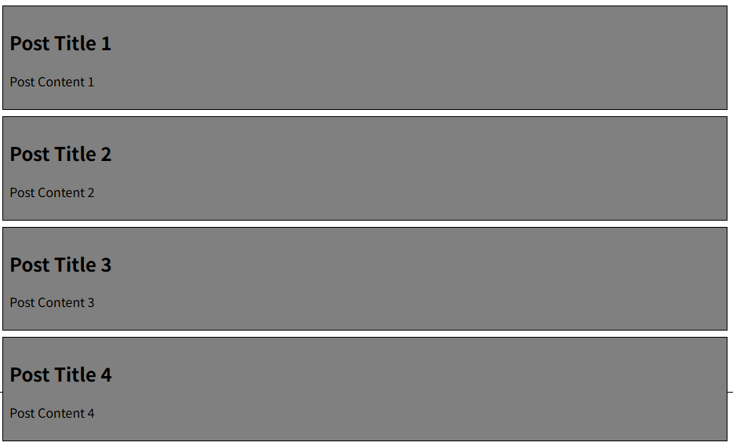
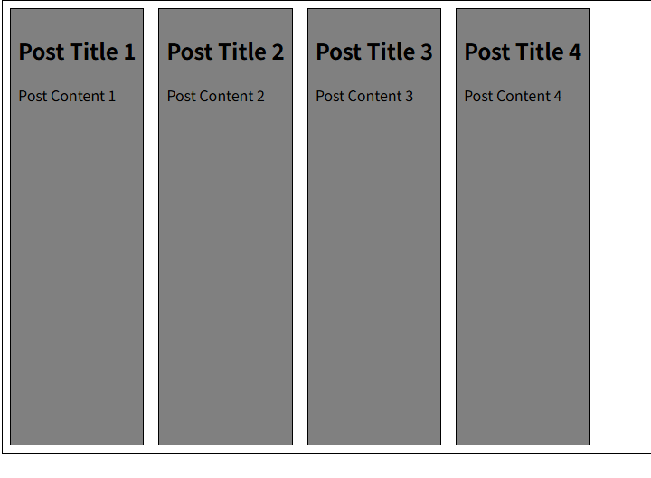
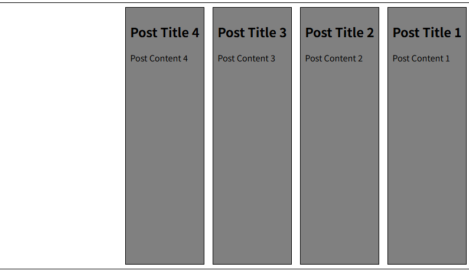
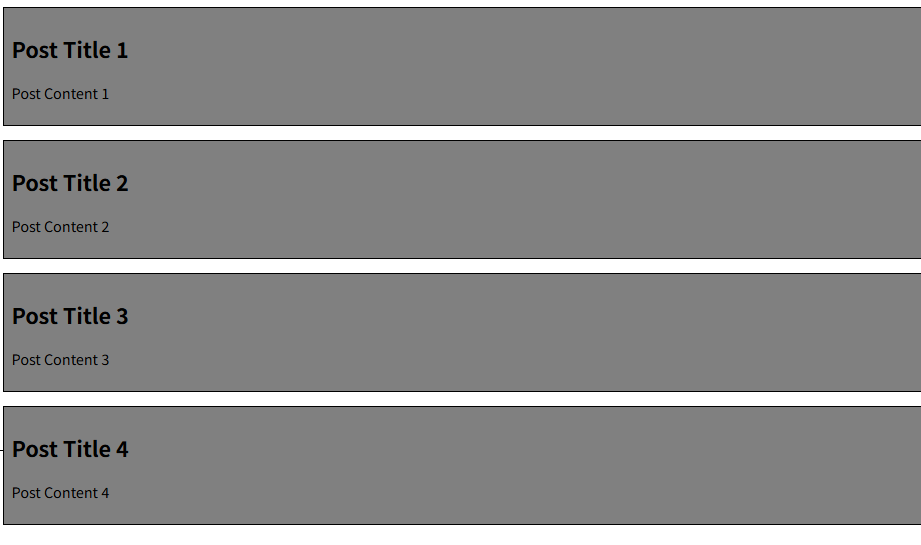
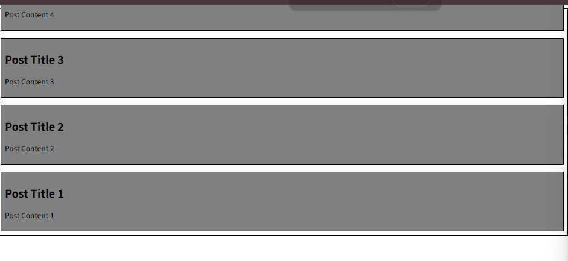

# FlexBox 속성

## 📌 Flexbox 속성 목록

| 구분                         | 속성                                                                                                            |
| ---------------------------- | --------------------------------------------------------------------------------------------------------------- |
| **Flex Container 관련 속성** | `display` <br> `flex-direction` <br> `flex-wrap` <br> `justify-content` <br> `align-items` <br> `align-content` |
| **Flex Item 관련 속성**      | `align-self` <br> `flex-grow` <br> `flex-basis` <br> `order`                                                    |


### 1. Flex Container 지정
- display 속성을 flex로 설정하면 Flex Container로 지정됨
- flex item은 기본적으로 행(주 축의 기본값인 가로 방향)으로 나열
- flex item은 주 축의 시작선에서 시작
- flex item은 교차축의 크기를 채우기 위해 늘어남

- Before



- After



```css
.container {
      height: 500px;
      border: 1px solid black;
      display: flex;
}
```

### 2. flex-direction
- flex item이 **나열되는 방향을 지정**
- 속성
  - row(기본값): 아이템을 가로 방향으로 좌->우 배치
  - column: 아이템을 세로 방향으로 상->하 배치
  - '-reverse'로 지정하면 flex item 배치의 시작선과 끝선이 서로 바뀜
- before


```css
    .container {
      height: 500px;
      border: 1px solid black;
      display: flex;
      /* flex-direction: row; */
      flex-direction: column;
      /* flex-direction: row-reverse; */
      /* flex-direction: column-reverse; */
    }
```
- `flex-direction: row-reverse;`
- 


- `flex-direction: column;`



- `flex-direction: column-reverse;`



